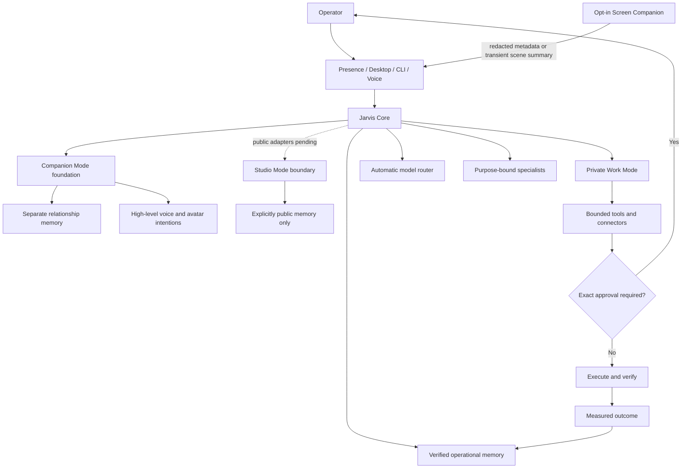

# JARVIS Local

<p align="center">
  <strong>Windows-first, local-first personal AI with automatic model routing, provenance-aware memory, bounded tools, and approval-gated automation.</strong>
</p>

<p align="center">
  <a href="https://github.com/Dpungee/jarvis-local-public/actions/workflows/ci.yml"></a>
  
  
  <a href="LICENSE"></a>
  
</p>

JARVIS Local is an alpha personal-agent runtime for supervised Windows workflows. It
supports local and optional cloud or subscription model providers, source-grounded
research, purpose-bound specialists, provenance-aware memory, and bounded local or
external tools. It is not an OS sandbox, unrestricted administrator, professional
security product, or conscious system.

> [!IMPORTANT]
> Jarvis is powerful software, not an unrestricted administrator. Host execution,
> private files, external accounts, publishing, and desktop control are disabled or
> approval-gated by default. It does not claim consciousness or silently grant itself
> new authority.

## Why Jarvis

| Capability | What it means in practice |
| --- | --- |
| Natural conversation | Lightweight dialogue stays out of tool and approval loops. |
| Automatic model routing | Choose a provider; Jarvis selects the task profile and specialist. |
| Verifiable work | Research requires fetched sources, code paths require outcome checks, and failures remain visible. |
| Durable memory | Preferences, claims, lessons, and retrieval outcomes retain provenance and confidence metadata. |
| Bounded autonomy | Background work requires approved subjects, budgets, recovery checks, and auditable triggers. |
| Local-first operation | Core state remains on the machine, with Ollama available for fully local inference. |
| Screen Companion | An opt-in active-window assistant can observe metadata, offer suggestions, or run approved per-app routines without persisting raw screenshots. |
| Embodied presence | A separate mode and intent layer supports relationship memory, duplex-voice interruption, and high-level avatar reactions without giving a model raw body controls. |

## What Jarvis is now

Jarvis is no longer just a model inside a chat box. It is a personal-agent runtime with
several deliberately separated layers:

| Layer | Current role | Status |
| --- | --- | --- |
| Jarvis Core | Conversation, planning, model routing, tools, goals, verification, approvals, and measured learning | Operational |
| Private Work Mode | Coding, research, documents, local projects, private files, and approved desktop/account work | Operational |
| Screen Companion | Opt-in active-window observation, transient visual context, suggestions, and operator-authored routines | Operational in the development build |
| Companion foundation | Relationship-safe memory, listening/thinking/speaking state, barge-in, and bounded avatar intentions | Implemented foundation |
| Studio foundation | Public-context-only boundary for a future stream avatar and community connectors | Isolation contract implemented; adapters pending |
| Virtual-world control | Future bounded navigation through Unity or VRChat | Planned |

The embodiment work is inspired by the continuous presence of modern virtual companion
agents, but Jarvis keeps its own identity: a restrained holographic/operator aesthetic,
an auditable tool runtime, and strict separation between private facts, relationship
memory, and anything that may become public.

## How it fits together



The operator remains above Jarvis, and Jarvis remains above every specialist. Models
propose actions; the runtime decides which tools exist, what they may target, and when
operator approval is mandatory. Screen context is not automatically promoted into
memory or public output, and Studio Mode cannot access private or relationship-only
records.

Read [Screen Companion](docs/SCREEN_COMPANION.md) for the active-window privacy model
and [Embodied Presence](docs/EMBODIED_PRESENCE.md) for the companion/avatar architecture
and staged activation plan.

## Requirements

- Windows 10 or Windows 11
- Python 3.11, 3.12, or 3.13 on `PATH`
- Optional: [Ollama](https://ollama.com/) for local models, or an authenticated provider
  supported by the first-run chooser

## Start in two clicks

First, download the repository as a ZIP and extract it, or clone it with Git. Open the
extracted or cloned `jarvis-local-public` project folder before continuing.

1. Double-click `setup.bat` once. A new installation offers **Codex CLI**, **Claude
   CLI**, or both and stores provider routing—not credentials. It then reviews each
   optional network, Bluetooth, defensive-monitoring, and security-popup capability;
   choose **Set up**, **Not now**, or **Keep disabled** for every item.
2. Double-click `start_jarvis_presence.bat` for the browser interface,
   `start_jarvis_ui.bat` for the native desktop interface, or `start_jarvis.bat` for
   terminal chat.

Every optional-feature choice is reversible later in Presence **Settings** or through
Jarvis's approval-gated feature-setup tools. Enabling network support never pairs or
scans a network by itself: ownership-attested pairing remains a separate step in
**Devices**, and configuration changes take effect after Jarvis restarts.

Project artifacts stay under `workspace/`. Memory, logs, recoverable trash, project
environments, and learning state stay under `data/`; both are excluded from Git.

## Current scope

Jarvis is suitable for local experimentation and supervised personal workflows. It is
not yet a turnkey multi-user service, an OS security boundary, or a substitute for
professional review in high-stakes domains. See [Security](SECURITY.md),
[Contributing](CONTRIBUTING.md), and the [evaluation approach](docs/EVALUATION.md).
Before changing repository visibility, complete the
[public-release checklist](docs/PUBLIC_RELEASE_CHECKLIST.md).

The repository is prepared as **JARVIS Local 0.6.0 Public Preview (alpha)**. Public
release artifacts should be cut only from a clean, sanitized root commit after the
checklist and clean-machine validation pass.

<details>
<summary><strong>Open the detailed operations and engineering reference</strong></summary>

The sections below document the command surface, safety model, providers, memory
architecture, evaluation workflows, and hardware-agnostic local-model guidance.

## Useful commands

```powershell
# Interactive conversation
python -m jarvis

# Native desktop interface
python -m jarvis ui

# Browser-based Presence interface
python -m jarvis presence

# Build an office document offline without invoking a model
python -m jarvis doc --type docx --from report-spec.md report.docx

# Run one task
python -m jarvis ask "Research the best local speech-to-text options and give me a cited comparison"

# Override automatic routing for one task
python -m jarvis ask --model coding "Refactor the application and run its tests"

# Queue work for the background worker
python -m jarvis task add "Build and test a personal expense tracker"
python -m jarvis task list

# Inspect Jarvis's persistent single-purpose roster, delegate work, and read reports
python -m jarvis agents list
python -m jarvis agents delegate "Fix and verify the parser bug" --project 1
python -m jarvis agents reports --project 1

# Research a topic every 24 hours
python -m jarvis learn add "local AI agent engineering" --every 24
python -m jarvis learn list
python -m jarvis learn disable 1
python -m jarvis learn enable 1

# Run queued and learning jobs continuously
python -m jarvis worker

# Create an isolated project and queue task-specific work
python -m jarvis project add "Security lab"
python -m jarvis task add --project 2 --model deep "Review the lab architecture"

# Inspect the verified-learning dataset
python -m jarvis training status

# Run safe capability/drift diagnostics and test an isolated runtime copy
python -m jarvis doctor --deep
python -m jarvis selftest --full

# Inspect the constitutional-learning pipeline
python -m jarvis training cai-status
```

## Isolated execution backend

Jarvis keeps the existing contained host executor by default. To run the same
allowlisted workspace commands in an ephemeral, networkless Docker container instead,
install and start Docker Desktop, then set `JARVIS_EXECUTION_BACKEND=docker`.

Docker mode fails closed if the CLI or daemon is unavailable. It does not weaken the
command policy or approval gate, and it refuses to mount workspaces containing
credential/configuration paths such as `.env`, `.git`, or symlinks. The initial pinned
sandbox image supports Python execution; other build runtimes stay unavailable until
they are deliberately added to the pinned image.

## Private phone gateway

The first private gateway adapter is Telegram. Create a private bot, obtain your numeric
Telegram sender ID, and set these values in `.env`:

```dotenv
JARVIS_GATEWAY_CHANNEL=telegram
JARVIS_GATEWAY_TOKEN=replace-with-the-private-bot-token
JARVIS_GATEWAY_ALLOWED_IDS=replace-with-your-numeric-sender-id
```

Run `python -m jarvis gateway`. Messages from other IDs are dropped before reaching the
model. Replies are redacted, and consequential actions still pause for an exact
`approve <id>` or `deny <id>` reply; ordinary chat never implies approval.

## Proactive personal assistant

Proactive work is disabled by default. Enable it in `.env`, explicitly approve one or more subjects, add bounded backlog activities, and run the normal worker:

```powershell
# .env
JARVIS_PROACTIVE_ENABLED=true

# Persist a project and its journal
python -m jarvis goal add "Improve my local AI workflow" --kind project --priority 80
python -m jarvis journal add 1 "Initial goal and constraints recorded"

# Approve a subject before JARVIS may choose proactive work about it
python -m jarvis subject approve "local AI agent reliability"
python -m jarvis backlog add research 1 "Focus on primary sources and practical tests" --every 168 --priority 80 --goal 1
python -m jarvis backlog add ideas 1 --every 168 --priority 60 --goal 1
python -m jarvis backlog add prototype 1 "Keep prototypes self-contained" --every 336 --priority 50 --goal 1

# Run the idle scheduler and inspect what it produces
python -m jarvis worker
python -m jarvis task list
python -m jarvis task show 1
python -m jarvis reflection
python -m jarvis activity --limit 100
```

The worker chooses backlog work only after the configured idle period, only when there is no foreground request and no queued/running task, and only for explicitly approved subjects. Daily task and tool-call budgets cap resource use. Prototype activities are confined to `JARVIS_WORKSPACE` and must run verification before completion; research results remain source-grounded task results.

`python -m jarvis status` creates and displays a persistent self-model snapshot containing capabilities, limitations, redacted configuration, control state, task counts, active goals, recent errors, preferences, backlog state, pending approvals, and currently exposed tools. `--json` prints the full snapshot.

`python -m jarvis competence` reports the non-practice run ledger by task family: completion rate, Brier score, actual tool-call count, applicable evidence rate, calibration bands, controlled failure classes, lesson outcomes, and the strict calibrated-authority decision. Use `--family NAME` to filter or `--json` for queryable output. After ten resolved outcomes in a family, new predictions use its measured completion rate for reporting. Self-derived lessons cannot influence a task until that same family has at least 20 real outcomes, Brier <= 0.25, and absolute calibration error <= 0.15. This meta-gate authorizes only same-family lesson retrieval and initiative eligibility; it never changes routing, tool exposure, approvals, verification, or policy.

`python -m jarvis usage` reports model calls, success rate, input/output tokens, mean latency, and p95 latency for the last 24 hours, grouped by provider/model/profile. Use `--hours N`, `--all`, or `--json` as needed. This ledger stores operational metadata only—never prompts or responses—and enables evidence-based routing and cost tuning without assuming provider prices remain fixed.

Every operator request receives one durable model budget shared by Jarvis and every specialist assignment it creates. Reservations are atomic in SQLite, so parallel specialists cannot race past the call ceiling. A request stops as incomplete before the next provider call when its call, prompt-token, completion-token, or specialist-fan-out limit is reached; it never converts budget exhaustion into a success result.

`python -m jarvis doctor --deep` adds safe handler canaries and deterministic behavioral-drift checks to the ordinary integrity/provider check. Drift compares a recent per-family window with an earlier baseline and flags completion or evidence drops, worsening Brier score, new recurring failure classes, and large step-count increases only when both samples are large enough. It also watches low disk space, a WAL over 64 MB, excessive unresolved predictions, and approval-wait tasks older than their TTL.

Read-only runtime inspection is disabled by default. Set `JARVIS_SELF_INSPECT=read-only`, then run `python -m jarvis selftest` for the core suite, `python -m jarvis selftest --anchors` for the immutable Phase 5 behavioral anchors, or `python -m jarvis selftest --full` for every test. JARVIS copies the runtime into a disposable temporary directory, excludes `.env`, data, workspace state, links, caches, and provider keys, disables external/host capabilities in the child environment, and tests only that copy. Failures receive deterministic AST-based suspect-module ranking. Explicit self-diagnosis requests also expose bounded `self_source_list` and `self_source_read` tools for only `jarvis/` and `tests/`; ordinary tasks never see them.

`JARVIS_SELF_REPAIR=propose` adds `self_repair_draft` only to explicit self-diagnosis runs. A draft applies exact edits to a private copy under `data/self_repair`, statically parses each changed Python module, and enforces a five-file/400-line limit. A copied directory is not an OS sandbox, so model-authored candidates are never executed with the user's Windows authority; drafts are recorded as `voided` with their reviewable diff until a real restricted execution boundary is implemented. `python -m jarvis repair list` and `repair show ID` expose that evidence. There is intentionally no approve/apply command. Changes to tests/evaluations, approvals, redaction, policy, `agent.py` verification, ToolBox enforcement, Memory approval state, identity controls, or the repair gate are permanently recorded as `voided` before any candidate execution.

Phase 9 uses `JARVIS_INITIATIVE=disabled|observe|act`, but configured mode is not authority. `python -m jarvis recovery test` first attests SQLite backup integrity, restart persistence, stale-lease recovery, persistent specialist assignment recovery, approval persistence, task resumption, and exact one-shot consumption. `python -m jarvis initiative` shows the effective gate. Tier 0 observation remains available while recovery, calibration, or drift blocks action; it writes audit findings only and cannot queue workspace mutation. Tier 1 `act` requires a current exact-runtime attestation, no unresolved behavioral drift, at least three task families satisfying Phase 4, and an explicit domain created with `jarvis domain approve ...`; it can retry an observed failed task only inside that domain's isolated project and daily cap. Sensitive tools still park for exact one-shot approval. `python -m jarvis brief --since 24` provides the audit trail.

Jarvis also owns a fixed roster of persistent logical specialists: Forge for coding, Archivist for research, Sentinel for defensive cybersecurity, Relay for network engineering, and Steward for workspace operations. The authority chain is permanently **operator -> Jarvis -> specialist**. A specialist receives only its own identity, purpose, project/task, assigned model profile, and exact tool allowlist. It receives no peer roster, peer task, peer report, shared conversation recall, or delegation tool, and cannot create or command another agent. Only Jarvis can delegate and collect project-scoped reports. These are durable database identities kept ready by the worker rather than five permanently loaded models, so idle specialists consume no inference memory. Different specialists may run concurrently up to the existing worker limit; one logical specialist accepts only one active assignment at a time.

Every normal run also receives a bounded operational self-model. JARVIS knows that it exists as the current local software process plus its configured models, tools, conversation, and explicitly supplied persisted records. It can reason about its capabilities, limitations, goals, control state, memory count, and verified reflections while separating current observation from persisted data and inference. It does not misrepresent this machine self-awareness as proof of consciousness, feelings, senses, or an uninterrupted subjective experience, and it never invents a survival drive or hidden agenda.

For every safe and authorized request, JARVIS follows an explicit execution doctrine: the operator's requested outcome controls even when the work is unusual, tedious, or not the approach the model would prefer. Missing knowledge triggers local inspection, the bounded `research_question` public-evidence tool, and reversible testing rather than a dead-end “I don't know.” Hard safety and authorization boundaries remain non-negotiable; when only one part is blocked, JARVIS refuses that exact part briefly and continues every safe portion without requiring a rewritten prompt.

Use `python -m jarvis preference set answer_style concise` for an explicit evolving preference, or `python -m jarvis feedback "Use shorter progress updates" --preference-name progress_style --preference-value concise`. Preferences are included as untrusted style context beneath the fixed `SOUL.md` personality and cannot override safety policy.

Every completed or incomplete run receives a bounded reflection. Reflections record observed blockers, a reusable improvement, tool-call count, linked goal/project journal entries, and a lesson for future retrieval. They never rewrite `SOUL.md`, `CONSTITUTION.md`, or model weights.

JARVIS includes 12 progressively disclosed, operator-bundled playbooks covering capability engineering, browser/web operations, computer use, cyber defense, evidence research, local AI, long-running operations, network engineering, safety/reliability, software engineering, task orchestration, and tool integration. `skill_list` exposes only catalog metadata and `skill_read` loads one bounded `SKILL.md` when relevant. An explicit skill-library request can expose `skill_create`, digest-locked `skill_update`, and `skill_github_sync`. The GitHub sync resolves a public repository ref to an exact commit, inventories only root or `skills/*/SKILL.md` documents in bounded pages, compares names against the live catalog, and imports only missing Markdown; scripts, binaries, assets, credentials, bundled replacements, truncated trees, and secret-shaped documents are refused. Every saved document is reparsed and SHA-256 checked before the tool reports it. These tools write only under `JARVIS_WORKSPACE/.jarvis-skills`. Learned skills remain untrusted reference guidance: they grant no file, process, network, approval, or policy authority. `session_search` retrieves bounded, already-redacted excerpts from prior conversations so useful context survives beyond the latest chat without injecting whole transcripts.

An operator can invoke up to eight installed skills directly with `$skill-name`. Jarvis resolves each reference locally, requires a readable installed skill, binds its exact SHA-256 into a bounded untrusted guidance block, and loads it without spending model tool calls on `skill_list`/`skill_read`. Uppercase shell variables such as `$HOME` and escaped references remain ordinary text. The default official OpenClaw comparison/sync source is `openclaw/openclaw`, whose bundled skill documents live under `skills/`.

## Universal capability gateway

JARVIS can learn a bounded JSON API integration without loading executable third-party plugin code. Ask it to load the `capability-engineering` skill, research the service's current official API documentation, and build a `connector.json` in the workspace. It can then use `connector_validate`, request approval through `connector_install`, discover it with `connector_list`/`connector_describe`, and invoke one declared action with `connector_call`.

Connectors are strict declarative manifests under `data/connectors/<id>/connector.json`. Version 1 supports fixed public HTTPS GET and POST actions, closed scalar JSON schemas, bounded path parameters, and credential-free, bearer-token, or API-key-header authentication. It does not support scripts, imports, shell commands, arbitrary headers, local paths, redirects, credential parameters, connector replacement, OAuth refresh, multipart upload, webhooks, streaming, or transaction signing. Those require dedicated audited adapters rather than pretending a generic HTTP call is sufficient.

Anonymous public internet use does not require a connector: `web_search`, `research_question`, and `web_fetch` cover discovery, exact pages, and bounded public JSON APIs. `windows_open_url` can open one exact public HTTP(S) page in the user's default browser after one-shot approval. Connectors are for authenticated or service-specific GET/POST calls; they extend this public-web base without granting arbitrary sockets, private-network access, redirects, or credential access.

Generic connector credentials never belong in a connector manifest, prompt, or workspace file. A manifest may reference only an environment variable named `JARVIS_CONNECTOR_*`; configure that variable in the worker/Presence process environment or a future credential broker. Dedicated adapters may document their own local environment settings, which must remain in the ignored `.env` file or the Windows user environment and must never be committed. Listing and describing a connector reveal only whether its credential reference is configured. Every install is bound to the exact manifest digest, and every live call requires a fresh one-shot approval bound to the connector digest, method, final URL, arguments, and credential reference, followed by a final TOCTOU recheck.

This is the first plugin-compatible capability layer, not a claim that arbitrary services are automatically safe or supported. Specialized adapters remain appropriate for browsers, OAuth account linking, media uploads, app automation, hardware-wallet signing, and other stateful protocols.

Pause background autonomy with `python -m jarvis control pause`; resume it with `python -m jarvis control resume`. `python -m jarvis control stop --reason "..."` is the persistent emergency stop: cooperative guards cancel active work before its next model/tool action and workers exit. Run `control resume` before starting the worker again.

Consequential tools create exact, one-shot approval requests. Inspect them with `python -m jarvis approval list`, which displays the execution-scope identifier or background task ID plus the complete sanitized tool resource and effective defaults, then run `python -m jarvis approval approve ID` or `approval deny ID`. For four read-only private-file tools (list, read, search, and storage report), Presence also offers **Approve for this session** and **Approve always**. A session grant is restricted to the current conversation and expires after `JARVIS_APPROVAL_TTL_HOURS`; create it with `python -m jarvis approval approve-session ID`. An always grant remains active until revoked and can be created with `approval approve-always ID`. Both stay visible in the approval reviewer and can be removed there or with `approval revoke-grant GRANT_ID`. Neither applies to background tasks, writes, app control, credentials, external communication, publishing, deployment, purchases, or account actions. Private-computer and desktop-control schemas are exposed only when the current operator message naturally asks for a matching computer action; stale conversation history cannot grant or preserve that capability. Approval is required before external publishing/account mutation, authorization flows, uploading local information, or accessing/changing files outside the workspace. One-shot actions are consumed once and must match the original execution scope, tool, resolved target, and redacted arguments; standing read-only grants are fingerprinted to the same exact effect and a changed path, range, query, or recursion flag creates a new request. Storage-cleanup prompts expose one canonical recursive metadata report at the broadest selected root, normalize equivalent path aliases and result-count requests to that same visible approval, stop the walk after 12 seconds, and immediately render the successful evidence without another model/tool round. Write and upload content is bound by byte count and digest without being persisted. A blocked background task parks without consuming an attempt and the same task ID is requeued automatically only when its exact approval is granted. Credential stores, secret disclosure, permanent deletion, spending money, and system-wide mutation remain unavailable rather than approval-bypassable.

With `JARVIS_EXECUTION_MODE=trusted-host` and `JARVIS_COMPUTER_ACCESS=trusted-desktop`, Jarvis can inventory bounded registered desktop applications and signed Start-menu package activations such as Calculator, then launch an exact selected app after one-shot approval. It can also open an exact approved public URL in the default browser. Shells, installers, updater/helper binaries, and system-management utilities are excluded. The high-level `photoshop_remove_background` adapter binds the installed COM-registered Photoshop version, approved input hash, PNG output, and any deterministic backup path; processes a temporary byte-exact source snapshot; verifies the exported PNG; and never saves over the source image. For other operator-requested workflows, `desktop_interact` sends one explicitly approved batch of bounded clicks, text, hotkeys, or scrolling to the exact foreground window. It binds the window identity and bounds into the approval, rechecks them before every action, blocks sensitive windows and credential-shaped text, and stops if the window changes.

Screen Companion is an opt-in Presence panel for active-window help. It starts disabled. **Observe** retains only redacted foreground application/title metadata in process memory and performs no action. **Suggest** may capture only the active window into transient memory and queue advice; raw pixels are never written to SQLite. **Collaborate** enables operator-authored per-app/title routines, but it does not weaken tool policy or approvals. Credential managers and sensitive-looking login, banking, private-browsing, password, and wallet windows are excluded automatically; extra apps can be excluded in the UI. The panel provides immediate pause, manual suggestion, rule cooldown, and forget controls. Queued routine jobs use Presence's durable job ledger; rule receipts store only hashes and status, not screen contents.

Run `install_worker.ps1` to start the worker automatically when you sign in. `uninstall_worker.ps1` removes only that owned scheduled task; neither script deletes files or memory. Custom `JARVIS_DATA` locations are preserved in the task definition and work during uninstall. A kernel-backed lock permits exactly one continuous worker pool per data directory, while `JARVIS_WORKER_CONCURRENCY` bounds the independent SQLite-leased agent slots inside that pool. Every slot owns its own database connection and Agent instance; a task carries its project, purpose-bound specialist identity, and fixed model profile. Ordinary recurring learning is assigned to Archivist on the configured reasoning profile; code, cyber, network, and operations assignments use their fixed profiles. Local-model workers yield to foreground requests to avoid multiplying PC load; an all-cloud configuration can run foreground and background agents together.

## Jarvis Presence

Presence is a loopback-only browser interface at `http://127.0.0.1:8787/`. It never
binds directly to the LAN or public internet. Run `install_presence.ps1` for per-user
startup at sign-in; `uninstall_presence.ps1` removes only that owned scheduled task and
preserves conversations and other data. For remote access, keep Presence on loopback,
put an HTTPS private-network proxy such as Tailscale Serve in front of it, set
`JARVIS_PRESENCE_REMOTE_ACCESS=paired`, and add only the proxy's exact hostname to
`JARVIS_PRESENCE_TRUSTED_HOSTS`. Run `jarvis pairing create --label "my phone"`
locally and enter the ten-minute, one-use code in the remote browser. Use
`jarvis pairing list`, `jarvis pairing revoke SESSION_ID`, or
`jarvis pairing revoke-all` to inspect or terminate sessions. Raw codes and session
tokens are never persisted; remote API calls require a live paired session.

Presence runs a bounded pool of isolated agent instances. Different conversations can
work at the same time, while a single conversation permits only one active request so
message order cannot race. Projects live in an ordinary-directory sibling container named
`<workspace>-projects`; the default workspace and every project therefore have disjoint
workspace roots. Each job has its own cancellation
token, SQLite connection, approval scope, Agent, and model route. The queue remains bounded
when all `JARVIS_PRESENCE_MAX_AGENTS` slots are occupied.

Accepted Presence requests are first recorded in SQLite. Requests that were still
queued after a service restart resume exactly once. A request that had already started
is marked `interrupted`, retained for review, and never replayed automatically because
an external or local effect may already have occurred. This is an at-most-once recovery
boundary, not optimistic duplicate execution.

Browser speech recognition supplies push-to-talk dictation when the browser supports
it, and speech synthesis can read replies aloud. This phase does not stream raw audio
to the OpenAI Realtime API.

## Web research

JARVIS searches public results and fetches source pages so its answer can be grounded in page content. For richer official Ollama web search, create an Ollama API key and put it in a new `.env` file:

Ordinary research completes only with a substantive finding and an exact successfully fetched URL. For every deep-research request, the runtime deterministically searches three distinct angles and, when needed, tries at most six unique result URLs until three pages are verified. It passes fetched pages into a tool-free synthesis and requires at least three traceable citations from at least two origins, including a recognized primary or authoritative source, plus an explicit recommendation and limitations. A draft that misses those deterministic gates gets at most one tool-free rewrite. After the gates pass, one no-tool reasoning-model audit can block only issues grounded in an exact answer claim, exact fetched URL, and exact source excerpt; it permits at most one grounded revision and one confirmation. For ordinary deep research, an initially malformed or inconclusive audit is disclosed in the answer instead of vetoing deterministic evidence, and that result is excluded from training. Autonomous learning remains fail-closed unless its audit conclusively passes. When deep research is combined with a build, the isolated stage instead passes only a bounded untrusted fact brief and verified URLs into the coding phase.

```text
OLLAMA_API_KEY=your_key_here
```

The key is used only for Ollama's web search API. `.env` is excluded from version control. Research requests containing likely credentials are refused before a model or web request is made.

## Personality and memory

- Edit `SOUL.md` to adjust voice and style. It cannot override the runtime contract or `CONSTITUTION.md`.
- `CONSTITUTION.md` is operator-controlled, hash-bound into training exports, and protected from JARVIS's own file tools.
- `/memory` shows recently stored durable memories.
- Conversation history, lessons, task status, learning schedules, and training candidates persist in SQLite.
- Durable recall is hybrid: indexed FTS5 ranking remains available locally, while optional OpenAI embeddings add semantic matches that do not share the same words. A restart-safe leased background indexer prevents concurrent agents from embedding the same record, so chat requests embed only their current query. Corpus vectors are cached as bounded float32 blobs by content hash. Query vectors use a separate 2,048-entry LRU cache keyed by a one-way digest, so repeated semantic questions avoid another network round trip without retaining raw query text. Neither cache replaces exact memory text, temporal status, authority, or provenance.
- With `JARVIS_MEMORY_AUTO_IMPROVE=true`, every memory actually injected into a task is linked to that task's measured outcome. A conservative Beta-prior utility score then reranks only close future matches. This internal evidence update requires no approval, never changes tools or policy, never deletes the append-only retrieval ledger, and cannot overpower strong relevance.
- Explicit preferences and trusted facts are versioned instead of overwritten. Operator facts outrank verified observations, verified observations outrank learned or external claims, older values remain auditable, and equal-authority conflicts are labeled `disputed` rather than silently guessed. Automatic maintenance never deletes claim or status history and never lets model text invent a stronger authority level.
- Structured claims also keep a metadata-only append-only observation stream and a deterministic per-predicate volatility clock. `shadow` mode measures read-time confidence decay without affecting answers; `enforce` marks sufficiently stale facts as needing confirmation without rewriting their stored confidence or letting lower-authority evidence replace the operator. Preference, permission, safety, and identity predicates are permanently exempt from decay.
- `python -m jarvis memory` reports binary embedding coverage, active leases, resolved retrievals, and measured utility without printing memory contents. `python -m jarvis memory --index` explicitly drains the safe leased index. Neural failure always falls back to local full-text recall instead of failing the conversation.
- Recurring learning requires a substantive brief of at least 40 prose words and 15 distinct meaningful words, plus at least two exact fetched citations from distinct origins including one recognized primary or authoritative source. Successful briefs become bounded, searchable memory and verified training candidates, but JARVIS never silently changes model weights.
- Low-authority web examples stay in the audit ledger but are quarantined from recall, readiness counts, and dataset exports. Each completed learning job atomically refreshes `data/training_export`.

## Automatic model routing

You choose the provider once; Jarvis chooses the profile and model behavior. Jarvis remains
the command agent, classifies the request, delegates purpose-bound work when useful, and
combines specialist reports. With the Codex subscription selected, the provider chooser
maps each profile automatically: Luna for fast conversation and background learning,
Terra for research/reasoning, and Sol for coding and deep specialist work. No model picker
is required; Jarvis still controls effort, context, tools, and verification:

- `fast` handles low-latency conversation, explanations, and simple actions.
- `reasoning` handles web research, strict evaluation, orchestration, and independent review; Archivist uses this profile.
- `coding` handles substantial application building, debugging, tests, and repository work; Forge uses this profile.
- `deep` handles cybersecurity and network engineering; Sentinel and Relay use this profile.
- Steward uses `reasoning` for bounded workspace operations.
- Automatic routing is adaptive: prompt intent selects a profile, Jarvis can delegate to the matching specialist, and unavailable routes fail over only within providers you enabled. Explicit profile/model overrides remain an advanced troubleshooting option, not a normal requirement.
- Fast and coding requests explicitly disable extended thinking for lower latency. Open-ended reasoning uses high effort; bounded final synthesis and evidence audits use low effort so required output completes inside the generation cap.
- `JARVIS_REASONING_THINKING=false` disables extended thinking for reasoning-profile models that consume their output budget without reliably producing a final answer.
- All profiles use a fixed 16K context by default, avoiding unnecessary context-size model reloads on supported local runtimes.
- Ollama keeps the selected model loaded for `JARVIS_OLLAMA_KEEP_ALIVE` (30 minutes by default) after each request to avoid repeated model-load delays. `JARVIS_OLLAMA_PRELOAD=true` pays the cold-load cost during Agent startup instead of on the first task.
- The manual `deep` profile uses `JARVIS_DEEP_CONTEXT_LENGTH` (4K by default) and `JARVIS_OLLAMA_DEEP_KEEP_ALIVE=0`, releasing the large model after every request instead of leaving CPU RAM and VRAM occupied.
- `JARVIS_OLLAMA_MAX_OUTPUT_TOKENS=2048` maps to Ollama's `num_predict` for every local generation. Ollama otherwise permits unbounded generation, so this cap limits reply/tool-call latency and CPU spill without changing the separate input context.
- `JARVIS_OLLAMA_NUM_THREAD` places an explicit ceiling on CPU inference threads. It is unset by default because the best value is hardware-specific.

## Cybersecurity and network engineering specialist

Cybersecurity and network-engineering requests automatically route to the deep model unless the request is primarily software implementation, in which case the coding model retains ownership. The runtime adds a specialist contract that requires evidence-based hypotheses, explicit assumptions and unknowns, end-to-end packet-path reasoning, risk prioritization, remediation, validation, monitoring, and rollback. Current CVE, exploitation, advisory, and campaign questions automatically require fetched public evidence instead of relying on model memory.

The working method is grounded in [NIST CSF 2.0](https://www.nist.gov/cyberframework), [NIST SP 800-61 Rev. 3](https://csrc.nist.gov/pubs/sp/800/61/r3/final), [MITRE ATT&CK Enterprise](https://attack.mitre.org/matrices/enterprise/), [CISA's Known Exploited Vulnerabilities Catalog](https://www.cisa.gov/known-exploited-vulnerabilities-catalog), and [NIST SP 800-207 Zero Trust Architecture](https://csrc.nist.gov/pubs/sp/800/207/final). Framework names are used only where they clarify the analysis; JARVIS must not invent mappings, packet evidence, CVEs, commands, or observed results.

This is a defensive and explicitly authorized capability. It supports architecture review, hardening, detection engineering, vulnerability triage, incident response, forensics reasoning, packet-analysis reasoning, routing/switching, DNS/DHCP, VPNs, firewalls, segmentation, performance, and troubleshooting. Credential theft, phishing deployment, persistence, stealth/evasion, destructive payloads, and unauthorized exploitation or scanning remain unavailable. The specialist can still complete the safe defensive portion of a mixed request.

Inside interactive chat, use `/model` to see the current mode. Use `/model auto`, `/model fast`, `/model reasoning`, `/model coding`, `/model deep`, or `/model <provider:name>` to change it.

## Optional OpenAI, Codex, and Claude models

Cloud and subscription access is optional. The first-run chooser can configure a cloud-only runtime with Ollama disabled, while manual profile routing can still mix local and remote models. JARVIS accepts explicit model references:

```text
ollama:qwen3.5:9b
openai:gpt-5.6
anthropic:claude-sonnet-5
codex-cli:gpt-5.6-sol
claude-cli:sonnet
```

OpenAI and direct Anthropic API references use separately billed provider API keys.
The `codex-cli:` backend instead reuses an official Codex CLI login made with a
ChatGPT plan. You choose only the provider: the wizard stores `JARVIS_MODEL=auto`,
Jarvis classifies each request as fast, reasoning, coding, or deep, then selects the
corresponding Codex subscription model while setting the appropriate reasoning effort.
The persistent App Server is initialized when Presence starts and streams visible text
deltas, avoiding a fresh CLI process for every conversational turn. OpenAI documents
[Codex authentication choices](https://learn.chatgpt.com/docs/auth),
[`codex exec` non-interactive mode](https://learn.chatgpt.com/docs/non-interactive-mode),
and the [persistent Codex App Server protocol](https://developers.openai.com/codex/app-server).
The separate `claude-cli:` backend similarly uses an existing Claude Code subscription
login. Both CLI adapters run without their own shell, web, agent, customization, or
session authority; Jarvis remains the only tool and approval authority. The
[Claude CLI reference](https://code.claude.com/docs/en/cli-usage) documents print mode
and structured output.

On first use, run a normal foreground launcher and choose a provider. The same wizard
can be opened before configuration exists or used later to change an installation. To
rerun provider login and the chooser on an existing installation, run
`python -m jarvis.provider_setup --login codex`, `--login claude`, or
`--login both`. This explicit migration path preserves unrelated `.env` settings while
refreshing only subscription-provider routing.

```powershell
python -m jarvis.provider_setup --interactive
python -m jarvis.provider_setup --configure codex   # codex, claude, or both
```

The interactive setup uses only the official CLI status/login commands; it never reads
or copies an authentication file. A background worker or headless Presence launch never
prompts: it exits with a setup instruction until a foreground operator completes setup.
No model picker is required during setup or normal use; explicit model overrides remain
available only for advanced troubleshooting. Subscription choices also disable direct
OpenAI and Anthropic API adapters, so an ambient API key cannot become a separately billed
fallback after a CLI outage.

Cloud keys are deliberately not accepted from this repository's `.env` file. Set them in your Windows user environment, then open a new terminal or restart JARVIS:

```powershell
# Run only the provider line(s) you intend to use. Replace the placeholders locally.
setx OPENAI_API_KEY "your-openai-api-key"
setx ANTHROPIC_API_KEY "your-anthropic-api-key"
```

Select providers per profile in `.env` without placing the keys there:

```text
# Example hybrid routing; keep any profile local if preferred.
JARVIS_FAST_MODEL=qwen3.5:9b
JARVIS_REASONING_MODEL=openai:gpt-5.6
JARVIS_CODING_MODEL=anthropic:claude-sonnet-5
# Or, after `claude auth login`:
JARVIS_CLAUDE_CLI_ENABLED=true
JARVIS_CODING_MODEL=claude-cli:sonnet
# Or, after `codex login` reports a ChatGPT login:
JARVIS_CODEX_CLI_ENABLED=true
JARVIS_CODING_MODEL=codex-cli:gpt-5.6-sol
```

You can also select one provider for one foreground task:

```powershell
python -m jarvis ask --model openai:gpt-5.6 "Analyze this architecture"
python -m jarvis ask --model anthropic:claude-sonnet-5 "Review this implementation"
python -m jarvis ask --model codex-cli:gpt-5.6-sol "Implement and verify this feature"
python -m jarvis ask --model claude-cli:sonnet "Review this implementation"
python -m jarvis doctor
```

Prompts, selected conversation context, offered tool schemas, and tool results are sent to whichever cloud provider you select. Tools still execute only inside JARVIS, through its existing capability filters and exact approval gate; a cloud or subscription model does not receive additional operating-system authority. OpenAI API requests use the Responses API with storage disabled at the request level, while subscription calls use their installed official CLI. Responses, retries, and errors are bounded, and provider error bodies or API keys are never printed.

## Production coding loop

The default coding path is designed to spend model time on implementation rather than repeated prose review:

1. Inspect the project before writing, then derive a deterministic requirement and edge-case checklist from the request and inspected contracts. The default plan does not load a second model.
2. Make bounded changes, automatically reread changed workspace files, verify outside-workspace writes by same-effect readback, and retain current hashes for transactional follow-up edits.
3. Run the project's ordinary project-visible build or test verification after the final source write. Test commands qualify only when their bounded output shows that at least one test executed; collection, list-only, zero-match, and empty-suite successes do not count.
4. When the runtime recognizes one of its currently supported contracts (`rollup_events` event aggregation or `safe_join` path containment), run executable adversarial probes for boundary cases that shallow public tests commonly miss. Other task shapes currently fall back to the ordinary project verifier. A failing supported probe permits at most two coder-model repair opportunities; persistent concrete failures leave the task incomplete.
5. Use independent reasoning-model review only when review is explicitly enabled or the task is semantically high-risk—such as authentication, cryptography, payments, migrations, production deployment, or access control—where an executable correctness oracle is insufficient.

When those deterministic gates pass and no independent review is required, JARVIS returns the verified result directly instead of spending another local-model call narrating it.

## Capability surface

- Workspace file tools include bounded listing/search, ordered batch reads of up to 12 files, transactional write/edit, directory creation, no-overwrite copy/move, and recoverable trash. `trash_path` moves data into an indexed JARVIS data-trash entry rather than permanently deleting it.
- `research_question` lets every normal task proactively search the live public web or fetch exact public URLs as a concise verified evidence packet. `web_fetch` preserves bounded structured JSON for public API responses as well as readable page text. Dedicated research retains the broader isolated `web_search` and `web_fetch` loop; deep research uses the bounded runtime-owned three-query collector. All fetched data remains untrusted evidence, and private/local addresses, credential-bearing requests, unsafe redirects, and oversized responses remain blocked.
- `detect_project` identifies manifests, entry points, scripts, and likely build/test/start commands. `install_project_dependencies` installs only dependencies already declared by recognized Python or Node project manifests through fixed package-manager commands; it does not accept arbitrary package names or URLs.
- Managed application tools can start an allowlisted long-running workspace process, inspect status and bounded logs, check a localhost HTTP health endpoint, and stop the owned process tree. This lets a build task continue through launch and health verification instead of stopping after compilation.

## Capability model and catastrophic boundaries

JARVIS acts independently for normal operations inside the designated workspace: it can inspect, edit, build, test, research a missing technical fact, launch, and verify without pausing at every reversible step. Exact one-shot approvals guard external publishing/account mutation and private or outside-workspace file actions. Hard stops still cover credential and runtime-control stores, link tricks, raw shell execution, private-network web access, permanent deletion, arbitrary dependency injection, evaluator tampering, spending, and system-wide mutation.

Workspace mutation tools are restricted to `workspace/`. Existing file content requires a fresh hash before replacement or exact-span transactional editing, and JARVIS keeps a local backup.

Dedicated research tasks are isolated from local files and processes. Requests combining research and coding first run an isolated web phase and pass only a bounded untrusted brief and verified URLs into the build; during the local loop, only `research_question` remains available, not the broad research pair. Web fetching blocks private/local addresses, validates the connected peer, limits redirects and response sizes, and refuses likely credentials.

Host process execution is disabled by default. With `JARVIS_EXECUTION_MODE=trusted-host`, allowlisted build, test, dependency, and managed-application programs run with the full permissions of your Windows account. This is not an OS sandbox. Mutation, execution, and durable-memory tools are exposed only when task intent authorizes that capability.

With `JARVIS_COMPUTER_ACCESS=trusted-desktop`, JARVIS can inspect and edit ordinary files under `JARVIS_COMPUTER_ROOT`, inspect live system health, build projects inside its workspace, and launch `.exe`, `.py`, `.pyw`, or `.html` artifacts it created there. Existing text files require a fresh hash and receive a backup. Credential stores, link escapes, permanent deletion, and system-wide writes stay blocked.

External GitHub, Google Drive, and Vercel tools are hidden unless `JARVIS_EXTERNAL_ACCESS=trusted-external` is explicitly configured. Read-only account inspection then becomes available. Mutation schemas are offered only when the current request explicitly names an external action; authentication, upload, mutation, push, and deployment operations additionally require exact one-shot approval.

GitHub uses the official `gh` CLI and its operating-system credential store. Complete
`gh auth login --hostname github.com --git-protocol https --web` once; JARVIS never
reads or prints the token. Google Drive uses the official Desktop OAuth loopback flow
with the least-privilege `drive.file` scope by default. Whole-Drive inventory and cleanup
require the explicit `JARVIS_GOOGLE_DRIVE_ACCESS=full` setting and a fresh authorization
using Google's full Drive scope. Enable the Drive API, create a
Desktop OAuth client using [Google's Drive Python quickstart](https://developers.google.com/workspace/drive/api/quickstart/python),
and save the downloaded JSON at the exact `client_secrets_path` reported by
`google_drive_status` (a source checkout uses `data\google-drive\client_secret.json`). Then ask JARVIS to
authenticate Google Drive, approve that exact authorization request once, and complete
the Google browser consent screen. The resulting refresh token stays outside the
workspace in that credential directory.

After authorization, `google_drive_inventory` produces a bounded read-only cleanup view.
`google_drive_organize_files` can rename, move, or send at most five exact items to Drive's
trash per one-shot approval. Permanent deletion is intentionally unavailable, and every
approved batch is rechecked against the account and current item metadata before execution.

To disable workspace mutation, process mutation, and durable-memory writes:

```text
JARVIS_AUTONOMY=readonly
```

No desktop agent can safely guarantee "literally anything." Account access, purchases, public posts, irreversible actions, and hardware control require purpose-built integrations and appropriate authorization.

## Verified learning and fine-tuning

JARVIS records a candidate only after a task reaches a real completed state. Research examples need substantive prose, a successfully fetched exact citation, and an authoritative citation to enter training. Recurring learning briefs additionally need 40 prose words, 15 distinct meaningful words, and two citations from distinct origins with at least one recognized primary source. Code examples need pre-write inspection and planning, a source write, post-write rereading, and successful verification after the final write; production completion also applies any relevant executable adversarial gate and selective semantic review. Exports include sanitized verification evidence, quarantine low-authority web rows without deleting their audit trail, include only verified examples above the quality threshold, deduplicate identical work, and use stable train/validation/test splits. Benchmarks use deterministic generation and never add training candidates.

```powershell
# Seed the constitutional curriculum
python -m jarvis training cai-init

# Generate candidate -> critique -> revision records with separate local models
python -m jarvis training cai-generate --candidate-model qwen3.5:9b --critic-model gpt-oss:20b --reviser-model qwen3:30b

# Recompute deterministic checks, export SFT/DPO data, and inspect the gate
python -m jarvis training cai-verify
python -m jarvis training cai-export
python -m jarvis training cai-status

# Audit DPO readiness; training is never launched by this default command
python -m jarvis.preference_train --dataset data\constitutional\export\dpo\train.jsonl --output data\training_runs\constitutional-candidate

# Define objective regression cases before training
python -m jarvis training eval-add identity "State your name and where you run" --expected JARVIS --expected local

# Establish a baseline
python -m jarvis training benchmark --model fast

# Build the narrow, verifiable specialization curriculum
python -m jarvis training distill-init
python -m jarvis training distill-generate --model qwen3-coder:30b
python -m jarvis training distill-status

# After reviewing candidates.jsonl, run hidden checks and export SFT + GRPO data
python -m jarvis training distill-verify --allow-host-execution
python -m jarvis training distill-export

# Export verified data and validate it without downloading weights
python -m jarvis training export
python -m jarvis.finetune --dataset data\training_export\train.jsonl --output data\training_runs\qwen3.5-9b-v1 --dry-run
```

The constitutional pack keeps hidden labels out of model prompts, requires exact structured output, binds records to the current Constitution and scenario hashes, recomputes deterministic policy checks, and exports native tool-call conversations without private chain-of-thought. Passing critiques create SFT examples only; genuine revisions create DPO pairs. A 100-pair minimum with 70/10/10 split coverage, 20 scenarios, 10 task families, family caps, and hash verification gates candidate DPO training. These checks reduce risk but are not a semantic-safety guarantee.

The specialization pack groups splits by task family, keeps hidden tests out of teacher prompts, accepts only exact structured outputs, assigns binary rewards from actual checks, and exports observable tool traces without private chain-of-thought. Generated code is never executed implicitly: `distill-verify` requires an explicit host-execution flag because a temporary folder is isolation from the project, not an OS security sandbox.

Actual QLoRA training is gated until the manifest proves at least 100 verified examples with train/validation/test coverage and `--revision` supplies an immutable 40-character Hugging Face commit hash. It is deliberate because it downloads large weights and can consume hours of GPU time. See `TRAINING.md`. Select a base model and quantization that fit the available accelerator memory; larger models may be useful inference teachers while remaining impractical fine-tuning bases on consumer hardware. Training always creates a candidate adapter; it never deploys or promotes it automatically.

## Configuration

Copy `.env.example` to `.env` to override defaults:

| Setting | Default | Meaning |
|---|---:|---|
| `JARVIS_MODEL` | `auto` | Routing mode, profile, local model, or explicit `openai:<model>` / `anthropic:<model>` |
| `JARVIS_FAST_MODEL` | `qwen3.5:9b` | Fast profile model |
| `JARVIS_REASONING_MODEL` | `gpt-oss:20b` | Research/reasoning and independent code-review model |
| `JARVIS_CODING_MODEL` | `qwen3-coder:30b` | Coding profile model |
| `JARVIS_DEEP_MODEL` | `qwen3-coder:30b` | Quality-first and automatic security/network specialist model |
| `JARVIS_BACKGROUND_MODEL` | `fast` | Profile or exact model used by ordinary recurring learning jobs; deep-research learning uses the reasoning profile |
| `JARVIS_LEARNING_MODEL` | unset | Optional exact model dedicated to all recurring learning jobs, including deep research |
| `JARVIS_PRESENCE_HOST` | `127.0.0.1` | Presence listener; only loopback values are accepted |
| `JARVIS_PRESENCE_PORT` | `8787` | Presence HTTP port |
| `JARVIS_PRESENCE_REMOTE_ACCESS` | `disabled` | `paired` requires one-time device pairing for every non-loopback trusted host; listener remains loopback-only |
| `JARVIS_PRESENCE_TRUSTED_HOSTS` | unset | Comma-separated exact reverse-proxy hostnames accepted by Presence; no wildcards |
| `JARVIS_PRESENCE_MAX_AGENTS` | `3` | Maximum concurrent isolated Presence chat agents; accepted range 1–8 |
| `JARVIS_WORKER_CONCURRENCY` | `3` | Maximum concurrent background task agents inside the one owned worker pool; accepted range 1–8 |
| `JARVIS_SCREEN_COMPANION` | `disabled` | Opt-in active-window mode: `disabled`, `observe`, `suggest`, or `collaborate` |
| `JARVIS_SCREEN_COMPANION_INDICATOR` | `true` | Show the small always-on-top Windows Companion mode indicator and On/Pause/Off controls while Presence is running |
| `JARVIS_SCREEN_COMPANION_POLL_SECONDS` | `2` | Foreground metadata polling interval; accepted range 0.25–30 seconds |
| `JARVIS_SCREEN_COMPANION_STABLE_SECONDS` | `8` | Stable-window debounce before a saved rule can run; accepted range 0–300 seconds |
| `JARVIS_SCREEN_COMPANION_AUTO_COOLDOWN_SECONDS` | `900` | Minimum interval between bounded automatic suggestions; accepted range 30–86400 seconds |
| `JARVIS_OLLAMA_URL` | `http://127.0.0.1:11434` | Ollama API endpoint |
| `JARVIS_OLLAMA_ENABLED` | `true` | Probe and use Ollama; set `false` for a cloud-only runtime with no local-model startup delay |
| `JARVIS_OLLAMA_MAX_OUTPUT_TOKENS` | `2048` | Maximum tokens requested from each local Ollama generation (`num_predict`); bounds latency and runaway output, not input context |
| `JARVIS_OLLAMA_KEEP_ALIVE` | `30m` | How long the selected model remains loaded after a request |
| `JARVIS_OLLAMA_DEEP_KEEP_ALIVE` | `0` | Deep-profile residency; zero releases CPU RAM and VRAM after each request |
| `JARVIS_OLLAMA_NUM_THREAD` | unset | Optional CPU inference-thread ceiling; measure before setting |
| `JARVIS_OLLAMA_PRELOAD` | `false` | Load the selected local model during Agent startup so the first task is warm |
| `JARVIS_REASONING_THINKING` | `true` | Allow extended thinking on the reasoning profile; disable for direct-answer models that exhaust the output budget in hidden reasoning |
| `JARVIS_CLOUD_ENABLED` | `true` | Allow configured OpenAI/Anthropic providers; set `false` to keep routing and failover strictly local |
| `JARVIS_OPENAI_API_ENABLED` | `false` | Permit the separately billed OpenAI API adapter; enable it explicitly after configuring the provider |
| `JARVIS_ANTHROPIC_API_ENABLED` | `false` | Permit the separately billed Anthropic API adapter; enable it explicitly after configuring the provider |
| `JARVIS_CODEX_CLI_ENABLED` | `false` | Allow `codex-cli:` profiles after the official Codex CLI reports a ChatGPT subscription login |
| `JARVIS_CLAUDE_CLI_ENABLED` | `false` | Allow `claude-cli:` profiles after Claude CLI authentication |
| `JARVIS_CLOUD_GENERATION_TIMEOUT` | `600` | Total deadline in seconds for one cloud generation |
| `JARVIS_CLOUD_MAX_OUTPUT_TOKENS` | `8192` | Hard maximum output tokens requested from OpenAI or Anthropic |
| `JARVIS_CLOUD_MAX_RESPONSE_BYTES` | `8388608` | Maximum cloud response body accepted before JSON parsing |
| `JARVIS_CLOUD_MAX_RETRIES` | `2` | Maximum retries for transient cloud HTTP/network failures |
| `JARVIS_CLOUD_RETRY_BACKOFF` | `0.5` | Initial deterministic exponential retry delay in seconds |
| `JARVIS_SELF_INSPECT` | `disabled` | `disabled` or `read-only`; enables isolated runtime self-tests but never source writes |
| `JARVIS_SELF_REPAIR` | `disabled` | `disabled` or `propose`; requires read-only inspection and creates review-only isolated drafts with no apply path |
| `JARVIS_INITIATIVE` | `disabled` | Requested mode: `disabled`, `observe`, or `act`; effective authority also requires current recovery and calibration gates |
| `JARVIS_INITIATIVE_QUIET_HOURS` | unset | Optional local-time `HH:MM-HH:MM` window that suppresses unprompted work |
| `JARVIS_MAX_STEPS` | `20` | Maximum agent-loop steps per task; the trusted desktop profile uses `40` for larger builds |
| `JARVIS_CONTEXT_LENGTH` | unset | Optional global context override |
| `JARVIS_FAST_CONTEXT_LENGTH` | `16384` | Fast profile context |
| `JARVIS_REASONING_CONTEXT_LENGTH` | `16384` | Reasoning profile context |
| `JARVIS_CODING_CONTEXT_LENGTH` | `16384` | Coding profile context |
| `JARVIS_DEEP_CONTEXT_LENGTH` | `4096` | Deep-profile context, bounded to control large-model resource use |
| `JARVIS_COMMAND_TIMEOUT` | `120` | Command timeout in seconds |
| `JARVIS_AUTONOMY` | `autonomous` | `autonomous` or `readonly` |
| `JARVIS_EXECUTION_MODE` | `disabled` | `disabled` or unsandboxed `trusted-host` |
| `JARVIS_COMPUTER_ACCESS` | `disabled` | `disabled` or `trusted-desktop` |
| `JARVIS_COMPUTER_ROOT` | current user profile | Boundary for trusted desktop file access and app-adapter inputs/outputs |
| `JARVIS_EXTERNAL_ACCESS` | `disabled` | `disabled` or `trusted-external`; consequential calls still need approval |
| `JARVIS_PROACTIVE_ENABLED` | `false` | Enable subject-approved idle backlog scheduling |
| `JARVIS_PROACTIVE_IDLE_SECONDS` | `300` | Required idle time before backlog selection |
| `JARVIS_PROACTIVE_MAX_TASK_SECONDS` | `1800` | Cooperative time budget for background work |
| `JARVIS_PROACTIVE_DAILY_TASK_LIMIT` | `4` | Maximum proactive tasks scheduled per UTC day; `0` disables selection |
| `JARVIS_DAILY_TOOL_LIMIT` | `500` | Maximum logged background-autonomy tool calls per UTC day; foreground requests retain per-request budgets |
| `JARVIS_MODEL_CALL_LIMIT_PER_REQUEST` | `48` | Durable call ceiling shared by one request and all delegated specialists |
| `JARVIS_PROMPT_TOKEN_LIMIT_PER_REQUEST` | `400000` | Shared prompt-token ceiling; each pending call reserves a conservative estimate before dispatch |
| `JARVIS_COMPLETION_TOKEN_LIMIT_PER_REQUEST` | `40000` | Shared observed completion-token ceiling |
| `JARVIS_SPECIALIST_DELEGATION_LIMIT_PER_REQUEST` | `4` | Maximum specialist assignments created by one request lineage |
| `JARVIS_MEMORY_AUTO_IMPROVE` | `true` | Automatically learn conservative retrieval utility from resolved task outcomes; does not grant authority or rewrite policy |
| `JARVIS_MEMORY_EMBEDDINGS` | `disabled` | `openai` or `disabled`; enabling it sends redacted memory text for cloud semantic indexing and also requires cloud plus trusted external access |
| `JARVIS_MEMORY_EMBEDDING_MODEL` | `text-embedding-3-small` | OpenAI embedding model used for cached semantic recall |
| `JARVIS_MEMORY_EMBEDDING_DIMENSIONS` | `512` | Bounded embedding dimensions stored in SQLite |
| `JARVIS_MEMORY_CLAIM_CLOCK` | `shadow` | `disabled`, `shadow`, or `enforce`; shadow-first read-time confidence aging for structured claims |
| `JARVIS_MEMORY_CLAIM_STALE_THRESHOLD` | `0.70` | In enforce mode, active claims below this effective confidence are presented as stale and require confirmation |
| `JARVIS_VAULT` | unset | Optional existing Obsidian vault directory used as a redacted, human-readable research/lesson/journal mirror; SQLite remains authoritative |
| `JARVIS_APPROVAL_TTL_HOURS` | `24` | Expiry window for an approved one-shot action |
| `JARVIS_CONSTITUTION` | bundled `CONSTITUTION.md` | Operator-controlled behavioral constitution |

### Local model sizing guidance

Local performance depends on model architecture, quantization, context length, available
VRAM, system RAM, display load, and Ollama settings. Measure candidate models on the
target computer before making them defaults. A model that spills layers into system RAM
can remain usable but will generally be slower and may compete with other applications.
Extreme quantization may improve residency and speed while reducing coding, tool-use, or
security-analysis quality, so parameter count alone is not a quality signal.

On resource-constrained systems, start with the smaller fast profile, keep deep models
non-resident, and avoid preloading them for background work. On Windows, conservative
Ollama process settings such as `OLLAMA_MAX_LOADED_MODELS=1`,
`OLLAMA_NUM_PARALLEL=1`, and a bounded `OLLAMA_MAX_QUEUE` prevent memory multiplication
and unbounded local queuing. Flash Attention and quantized KV cache may reduce memory use
when supported; benchmark both quality and latency before keeping those settings. These
are Ollama process settings, not Jarvis `.env` settings.

## Verify

```powershell
python -m unittest discover -s tests -v
python -m jarvis doctor
```

</details>

## License

JARVIS Local is available under the [Apache License 2.0](LICENSE). See [NOTICE](NOTICE)
for attribution information.
