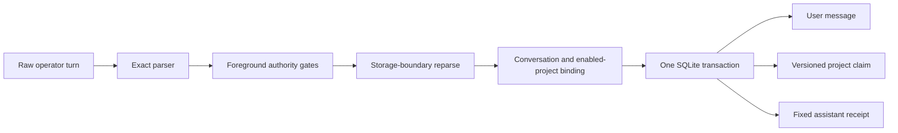

# Governed project memory (M1 slice)

This increment gives the foreground Jarvis agent one deterministic way to store
an operator-authored project fact. It is the first governed slice of the VTMF M1
workstream, not the complete memory roadmap and not a claim of a novel memory
architecture.

## Operator commands

Store or update one fact:

```text
Remember this project fact: {"subject":"AtlasNode","predicate":"release channel","value":"stable"}
```

Retire one fact (its version history is kept and past-tense questions still
see the retired value; `Retract this project fact:` and a leading `please`
are accepted spellings):

```text
Forget this project fact: {"subject":"AtlasNode","predicate":"release channel"}
```

Erase every version of one fact (a deletion with a tombstone receipt on the
memory spine; the only command that removes a value from temporal answers;
`Delete this project fact:` is an accepted spelling; see
[The memory spine](MEMORY_SPINE.md)):

```text
Erase this project fact: {"subject":"AtlasNode","predicate":"release channel"}
```

Erase one ordinary memory by its id (the fourth governed verb, schema 48;
`Delete memory #<id>` and a leading `please` are accepted spellings; see
[The memory spine](MEMORY_SPINE.md)):

```text
Erase memory #42
```

Make a staged learned skill live, or undo one (the fifth and sixth governed
verbs, schema 49; `Promote skill promotion #N <code>`, `Rollback`, `Revert`
and a leading `please` are accepted spellings; see
[The learning ladder](LEARNING_LADDER.md)):

```text
Approve skill promotion #12 7Yk2Qw8ZpL4mNt1v
Roll back skill promotion #12
```

The trailing value on an approval is a **confirmation code**, not a capability:
sixteen random characters generated when the document was staged, whose job is
to prove you looked at it. It is shown only by `jarvis ladder list`,
`jarvis ladder show` and `/ladder`, only while the promotion is still staged,
and it is single use. A rollback needs none — undo must never be the harder
direction. The transcript keeps your command with the code replaced by
`<confirmation code>`, so it never travels into a later prompt.

All six verbs share the same discipline: parsed from your raw turn before any
model call, exact in shape, and a recognized near-miss is refused **as that
verb** rather than handed to a model.

List the active facts of a project:

```text
python -m jarvis facts [--project N] [subject words]
```

List ordinary memories with the ids that command names:

```text
python -m jarvis memory list [--limit N] [--json]
```

or `/memory` inside `python -m jarvis` chat.

or `/facts` inside `python -m jarvis` chat. Listing goes through the same
screened read path as recall, so an out-of-band corrupted row is never printed.

A fact stated in ordinary conversation is not stored; the reply says so and
shows the exact command, and the next turn may confirm it with `store it` (see
"The negative receipt" below).

Receipts are fixed strings: `Stored project fact (claim record #N).`,
`Reasserted project fact (claim record #N).`, `Updated project fact (claim
record #N). The prior value remains in this project's version history.`,
`Retracted project fact (claim record #N). It is no longer current; the version
history is kept.`, `Erased project fact (N versions removed; tombstone #E). M
transcript copies remain until their conversations are deleted.`, `No project
fact matches that subject and predicate; nothing changed.`, and `No active
project fact matches that subject and predicate; nothing changed.` None of
them repeats the stored value.

`subject`, `predicate`, and `value` must be non-empty strings. Extra, missing,
duplicate, nested, or non-string fields are rejected. A command cannot be
combined with attachments or another action.

## Deterministic write path



The parser runs on the raw operator prompt before contextual rewriting. A
recognized but malformed command owns the turn and fails closed; it never falls
through to a model or the broader free-form memory tool. The storage method
reparses the original command and revalidates the enabled project and
conversation binding inside the write transaction.

Ordinary questions and past-tense discussion about a project fact are not
commands. A direct near-command wrapper with a payload is still owned and
rejected with an exact-format error, preventing it from reaching another write
lane without misreporting ordinary dialogue as Unicode corruption.

The user command, claim, supersession state, and assistant receipt commit or
roll back together. Cancellation has authority before that transaction. Once it
commits, cancellation and best-effort event reporting cannot make Jarvis report
that the durable effect did not happen.

This path makes zero model calls and zero tool calls. Model text cannot choose
the subject, predicate, value, project scope, provenance, authority, or
confidence. Stored project facts always use operator authority and confidence
1.0 with fixed local provenance.

## Scope and retrieval

Each fact is bound to `project:<id>`. Reasserting the same triple retains one
active claim. A different value for the same normalized subject and predicate
supersedes the prior value without deleting history.

For a model-visible read:

- only global claims and claims from the enabled active project are eligible;
- an active project claim shadows a same-key global claim;
- another project's claims are never candidates;
- project claims use the typed claim lane and are excluded from ordinary lexical,
  semantic, hybrid, embedding-eligibility, and `/memory` listing surfaces;
- claim context is suppressed on mutation-capable turns, reducing the chance
  that stored prose can steer tools or writes.

Eligibility checks run after structural ranking, only for the strongest tier
and the selected rows. The strongest relevance tier remains fail-closed: if its
canonical backing record, evidence, scope, digest, or privacy checks fail,
recall abstains rather than substituting a weaker candidate. Exact reads
therefore avoid per-candidate work without converting integrity failure into
fallback behavior.

Identity proof is separate from topical overlap. Structured identifiers must
survive an exact-token postcheck after FTS discovery. Natural names use bounded
inflection-aware proof, so a stored `Atlas` record remains addressable without
letting an unknown `Cobalt` request reuse Atlas's matching topic words.

Schema v44 maintains an explicit, derived, hash-bound `ALLOW` or `DENY` quality
decision for every authenticated, privacy-clean learning record. A valid
`DENY` is removed before lexical, fallback, semantic, and embedding limits are
applied, so low-quality rows cannot consume candidate capacity. Missing,
private, secret, forged, or tampered material has no trusted decision and is
therefore `UNKNOWN`: it remains a conservative hard shadow during lexical
discovery and ranking, while semantic recall and embedding export require an
exact current `ALLOW`. The canonical external-content FTS index stays complete,
which keeps deletes, updates, and FTS rebuilds safe.

Quality decisions are rebuilt from authenticated canonical rows when missing.
Field changes invalidate the decision and any derived vector or lease; startup
verifies the exact invalidation-trigger definitions rather than trusting their
names. Semantic reads independently bind each stored vector digest to the exact
text snapshot and reject invalid or non-finite vector arithmetic.

Multi-query recall and its eligibility checks run in one SQLite snapshot.
Consequently, a concurrent repair cannot validate current safe data while an
older selected row leaks stale content or metadata. Claim-clock support
timestamps are also privacy-screened and timezone-validated before they can
affect or appear in recall output.

Recall caches are byte-bounded using recursive accounting. Raw structured claim
fields are represented in keys by digests, not retained as cache values, and a
cached eligibility decision is bound to the current claim, backing memory,
evidence, provenance, and scope fields. An out-of-band mutation therefore misses
the old entry and is revalidated. Ordinary and claim changes are logically
invalidated by their field-bound keys; vault replacement/deletion, conversation
deletion, and store close explicitly clear the applicable cache.

The generic global claim API remains global-only. It cannot be used to select a
project scope. Its write and read boundaries also reject credential field names
split across structured subject and predicate fields.

## The negative receipt: nothing was encoded

The model cannot write memory, and it is told so in its prompt. When an ordinary
turn states a fact in update form ("the Kestrel relay now listens on port 9191,
not 9090", "note that the frontend's tech lead is Alice Chen") and no governed
write happened, the runtime appends a deterministic note to the reply:

```text
Not stored: no project fact was written this turn.
To store it, send exactly:
Remember this project fact: {"subject":"Kestrel relay","predicate":"listen port","value":"9191"}
Or reply "store it" to store exactly that.
This will update the currently stored value for that subject and predicate.
```

The proposal comes from `jarvis/memory_extractor.py`, a closed rule grammar over
the operator's own words: possessive ("the relay's port is now"), relational
("listens on", "runs on", "is owned by", "moved to"), "is now" and "changed
from ... to" forms behind an update or statement cue; the structured forms
`subject's predicate: value` and `subject -> predicate -> value`; a plain copula
after a leading cue ("Going forward the canary percentage is 5%"); and a pronoun
clause resolved against the clause before it ("...; it listens on 9191"). A bare
noun phrase without a predicate ("Kestrel relay listen port is now 9191") is
split only at a property noun; "our primary database is now Postgres 16" yields
no proposal rather than a guessed split. Questions, requests, hypotheticals,
reported speech ("the docs say"), pronoun subjects, personal relations, and JSON
never produce a proposal. Every proposal has already passed the governed
parser, so pasting it can only store what the governed path would accept. When
a stored claim with the same subject and an overlapping predicate exists, the
proposal adopts that predicate so the write supersedes instead of forking a
sibling key. Restating a fact that is already stored produces no note.

### Model-assisted proposals (`JARVIS_MEMORY_PROPOSER=assisted`, the default)

The grammar proposes first and its proposals never change. When a tool-free
dialogue turn (never a task, coding, research, or deterministic turn, which
promise a fixed number of model calls; never readonly mode) carries a licensed
statement (an update or statement cue, not a question, request, conditional,
reported speech, pronoun or possessive subject, or code) that the grammar
cannot split and that names a project-shaped or stored subject, a
configured-value word, or a structured token, the local model is asked once,
tool-free, at temperature 0, for a strict JSON triple with a `source_span`.
The answer is not trusted as such: the span must be a whole-token substring of
the statement, the subject and value must be whole-token substrings of that
span inside a clause that is not negated or ruled out ("..., not Talon box"
never grounds `Talon box`), a one-word subject must be a whole noun phrase
(`relay` inside `Osprey relay` never grounds), the stored spelling is copied
from the operator's own characters, every predicate word must come from the
statement or from a predicate already stored for that subject, and the triple
must pass the governed parser. What survives is shown in the same negative
receipt with the line `Proposed by the local model from your words; confirm
only if it is exactly right.` and stored only on the operator's confirmation.
Set `JARVIS_MEMORY_PROPOSER=rules` to disable the model call; nothing else
changes. Subject aliasing is deterministic in both modes: a one-word subject
("the relay now listens on 9191") resolves to the single stored subject that
ends with that word ("Kestrel relay") when exactly one does.

### Confirming a proposal in one reply

The next operator turn may confirm the shown proposal instead of pasting it:
`store it`, `save that fact`, `yes, store it please`, `confirm`, or a bare `yes`.
When the reply also asked the operator a question ("Should I save the config
file too?"), only a confirmation that names memory unambiguously counts
(`store`, `remember`, `persist`, or "... that fact"); `yes`, `save it`, or
`confirm` then answer the question as ordinary dialogue. The confirmation is
governed the same way as the command. The runtime keeps its own record of
every proposal it shows (`memory_fact_proposals`, keyed by the assistant
message that carried it), and a confirmation is resolved against that record
only: assistant text is never read, so a reply that imitates the receipt can
never be confirmed. For a grammar proposal the fact is then re-derived from
the operator's previous message and must equal the recorded command, otherwise
the turn answers `Not stored: the proposed fact changed since it was shown`
with the current proposal; for a model-assisted proposal the recorded command
must still be grounded in the operator's previous licensed statement (whole
tokens, a clause that is not negated or ruled out, a predicate whose words come
from the statement or from that subject's stored predicates, and the
extractor's own special-category and control-plane checks). The transcript keeps the operator's own words
(also when the confirmation is refused) followed by the exact command that was
stored and the fixed receipt, and the event
`governed project memory - confirmed proposal` precedes the usual
`stored`/`superseded` event. A confirmation is only valid while the receipt is
the last persisted message of the same interactive conversation: any turn in
between, including a crashed or cancelled one, ends the offer. It is never
offered to background, worker, companion, or specialist turns, nor with an
attachment or another action.

The same note, with the generic command shape, is appended when the model's
reply claims a memory write ("I've updated the project fact", "recorded in
memory", "claim record #", "remains in the version history") on a turn that
wrote nothing. A governed turn never receives the note; a readonly runtime names
the mode instead of a command. The event `governed project memory - not stored`
is emitted so the never-encoded case is observable.

## Reads that outrank the web, and what the model sees

An operator-stored fact for a named subject outranks weak web intent. A question
that would route to research only because it contains a recency word ("What is
the latest Kestrel relay listen port?", "...before the latest change?") stays on
the memory path when the claim lane holds a fact for that subject; an explicit
research command, URL, news, product, or security lookup keeps its web route.
The event `memory - stored project fact outranks weak web intent` records the
decision.

The `temporal_claims` block carries three statuses. `active` and `disputed`
claims are current. On a past-tense question ("what used to be", "before",
"previously") the former values of the matched claim keys are appended with
status `superseded` and a `superseded_at` timestamp; the model is told to report
them only as history. When the request names a project-shaped subject and the
claim lane holds nothing for it, the block holds a `not_recorded` entry for
that subject and tells the model to say the fact is not recorded and never to
offer a default, typical, or assumed value in its place. A subject is
project-shaped when it is a structured identifier (`Node7`), a proper name
followed by a lower-case noun (`Osprey relay`, `Harrier box`), or a proper name
next to a word that asks for a configured value (`Where is Osprey hosted?`).
A bare proper name in ordinary world knowledge ("the capital of France", "who
wrote Hamlet") names nothing, so general knowledge is answered as such. In the
dialogue lane the same rules ride with the block in the user turn, only when
the block carries such an entry, because the compacted runtime contract has
almost no headroom.

A named subject that has stored facts never receives a `not_recorded` cue for
an attribute the lane could not align ("What is the Kestrel relay firmware
version?" with only a listen port stored): its stored facts go into the block
tagged `match: subject`, and the model is told to say the asked fact is not
recorded rather than substitute one of them. Bounded to three subjects and six
rows on the same screened read.

### Retracted history: Forget keeps it, Erase removes it

After `Forget this project fact:` the retired value stays in the version
history, and a past-tense question about that subject ("What used to be the
Kestrel relay listen port?") still answers from it in any later conversation.
On a temporal question the agent reads `Memory.subject_claim_history` for each
project-shaped subject the question names (the same screened read path as the
claim lane, project scope shadowing global, look-alike subjects excluded,
newest first, at most six rows and three per key) and appends the former
values of every key that the main read did not match, each tagged `status:
superseded`, `superseded_at`, and `retracted: true` (the store's flag that the
key has no active or disputed row). Keys the main read matched keep the
ordinary superseded surfacing above, so a subject with one current fact and
one retracted fact shows both. When no entry is current the block's lead says
the fact was retracted and has no current value, and in the dialogue lane the
same rule rides with the block in the user turn; the model is told to answer
the past-tense question as history and never present the value as current.
The `not_recorded` cue never fires while the block holds such an entry; a
present-tense question about a retracted fact still receives it. Every
surfaced value passes the same secret and private-identifier screen as the
current claims, and the read never takes the write lock. Only `Erase this
project fact:` removes a value from temporal answers.

A question that spans two facts ("Which datacenter hosts the Kestrel relay?"
with `Kestrel relay / deployed on host / Harrier box` and `Harrier box /
datacenter / Fenwick` stored) receives a one-hop bridge: for each matched claim
whose value is itself a stored subject, that subject's claims are appended with
`bridge_from` naming the claim they hang off. The bridge reads eight rows per
value and keeps the ones whose predicate shares words with the question first,
so a subject with many facts does not lose the asked one to recency. It is
bounded to the first four matched claims, four bridged rows, one hop, the same
project scope, and the same screened read path; the subject-only fallback above
seeds it when the question shares no word with the stored predicate ("runs
on"). This is the smallest form of the graph-neighborhood stage the design
reserves for M3.

## Chained reads (schema 48)

A question that spans two or three stored facts is answered from a bounded walk
over the temporal graph, in either direction of every triple and with no model
call: "Which datacenter hosts the Kestrel relay?", "What runs on the Harrier
box?", and "Which region is the Kestrel relay in?" all answer from the same
three facts. Chain rows join the `temporal_claims` block carrying a `chain`
number and a 1-based `hop`, and a bounded read says so rather than presenting a
pruned list as complete. The one-hop bridge described above survives only for a
store without the projection. See [The temporal graph](MEMORY_GRAPH.md) for the
bounds, the identity floors, the widened privacy screen that the graph and the
history helpers apply, and the operator surfaces.

## Read path locking and scale

`current_claims` reads in one deferred snapshot and never takes the write lock.
Claim-clock telemetry is written afterwards in a separate short transaction with
a 250 ms lock timeout; under a concurrent writer the counters for that read are
dropped and counted in `_dropped_claim_clock_reads`, never turned into an error.
A locked database therefore degrades a turn to "no claims" rather than a crash.

Candidate discovery narrows in stages. If the OR-of-terms pool exceeds the
bound (2,000 rows, for example because every subject shares the predicate
"release channel"), the lane retries with every term required before abstaining,
so a unique subject still answers an exact lookup. Eligibility, including the
privacy scan, is validated after structural ranking and only for the strongest
tier and the selected rows; a corrupt strongest candidate still forces
abstention. `Memory.claim_recall_report()` describes the last claim-lane read
(`mode`, `candidates`, `returned`, `abstained`, `reason`), so an empty result is
never silent.

## Rejected content and authority contexts

The governed parser rejects:

- credentials, private identifiers, sensitive field names, and nested encoded
  forms used to hide them;
- identity, permission, preference, and safety predicate namespaces;
- role tags, prompt markup, instructions, deontic policy text, and agent/runtime
  control discourse;
- unsupported controls, default-ignorable characters, private-use characters,
  malformed encodings, excessive nesting, and over-limit fields;
- background tasks, proactive runs, specialists, internal Screen Companion
  conversations, disabled or mismatched projects, readonly mode, attachments,
  and combined actions.

These filters are a safety boundary, not a factuality oracle. Jarvis stores the
operator's explicitly supplied fact; it does not independently prove that the
fact is true.

## Model compatibility

The write mechanism is model-independent because parsing, authorization,
storage, supersession, and receipts are deterministic. The stored record is
portable across local and cloud models. Models can still differ in how well they
use the bounded typed evidence placed in context, so recall quality must be
measured per model/profile even though the memory record itself is universal.

Removing model-mediated write decisions may help most on models with weaker tool
reliability, but that is a hypothesis until the same agent cases are evaluated
per model. Larger models may use nuanced evidence packs differently; they do not
get additional memory authority.

## Measured acceptance and limits

Acceptance requires adversarial parser and scope tests, project round trips,
supersession and rollback tests, unchanged sealed retrieval precision/no-hit/
leakage gates, the complete repository suite, and public-release checks. Counts
and timings belong in the task handoff or release record rather than being
treated as permanent product guarantees.

This slice does **not** write memory from conversation on its own: the
post-turn proposers (grammar first, then the grounded model) only propose the
exact command, and the operator confirms by sending it or by replying
`store it` against the runtime's own record of what was shown. Since M2
slice 1 the claim lane is on the memory spine (lineage, deletion receipts,
erase with tombstone, rebuild), and since slice 2 ordinary memories and
lessons carry lineage and digest-only receipts on it too, the model's
`remember` tool is receipted as `actor=model` with the gate that admitted it,
and the claim rebuild can reconcile the live rows (`spine rebuild-claims
--apply --yes`); long-horizon rows keep their own ledger. See [The memory
spine](MEMORY_SPINE.md). It does not implement automatic consent inference,
temporal graph traversal, lesson-to-skill promotion, or typed compaction.
Those remain separate measured increments. Raw claim backing rows stay hidden
from generic `/memory` output because that surface has no project scope; use
`python -m jarvis facts` or `/facts` instead.

## Known limits of the extractor and filters

- The grammar proposes only declarative statements it can split
  deterministically; anything else yields no proposal, never a guess. Measured
  coverage belongs in the task handoff, not here. The model-assisted proposer
  (above) widens coverage behind the same parser and the same confirmation.
- Predicates beginning with `identity`, `permission`, `preference`, or `safety`
  are reserved namespaces even in natural phrasing ("identity provider"): use a
  different predicate word.
- Values containing deontic or control vocabulary ("must", "never", "policy",
  "approval") are rejected as instruction-like by design; store the fact in
  descriptive form.
- Paths under a home directory and e-mail addresses are rejected as private
  identifiers.

## Prior-art positioning

Tiered context, hybrid retrieval, episodic memory, graphs, checkpoints, and
consolidation are established agent-memory patterns. Jarvis should not present
this architecture as unprecedented. The engineering distinction to validate is
the deterministic, fail-closed, test-gated behavior around those patterns. No
"first" or market-superiority claim follows from this implementation alone.
