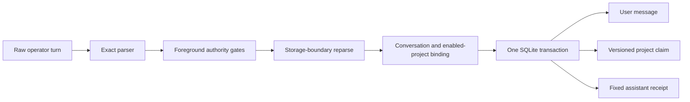

# Governed project memory (M1 slice)

This increment gives the foreground Jarvis agent one deterministic way to store
an operator-authored project fact. It is the first governed slice of the VTMF M1
workstream, not the complete memory roadmap and not a claim of a novel memory
architecture.

## Operator command

Use one standalone foreground command with exactly these fields:

```text
Remember this project fact: {"subject":"AtlasNode","predicate":"release channel","value":"stable"}
```

`subject`, `predicate`, and `value` must be non-empty strings. Extra, missing,
duplicate, nested, or non-string fields are rejected. The command cannot be
combined with attachments or another action.

The fixed response is one of:

```text
Stored project fact (claim record #N).
Reasserted project fact (claim record #N).
Updated project fact (claim record #N). The prior value remains in this project's version history.
```

The response deliberately does not repeat the stored value.

## Deterministic write path



The parser runs on the raw operator prompt before contextual rewriting. A
recognized but malformed command owns the turn and fails closed; it never falls
through to a model or the broader free-form memory tool. The storage method
reparses the original command and revalidates the enabled project and
conversation binding inside the write transaction.

Ordinary questions and past-tense discussion about a project fact are not
commands. A direct near-command wrapper with a payload is still owned and
rejected with an exact-format error, preventing it from reaching another write
lane without misreporting ordinary dialogue as Unicode corruption.

The user command, claim, supersession state, and assistant receipt commit or
roll back together. Cancellation has authority before that transaction. Once it
commits, cancellation and best-effort event reporting cannot make Jarvis report
that the durable effect did not happen.

This path makes zero model calls and zero tool calls. Model text cannot choose
the subject, predicate, value, project scope, provenance, authority, or
confidence. Stored project facts always use operator authority and confidence
1.0 with fixed local provenance.

## Scope and retrieval

Each fact is bound to `project:<id>`. Reasserting the same triple retains one
active claim. A different value for the same normalized subject and predicate
supersedes the prior value without deleting history.

For a model-visible read:

- only global claims and claims from the enabled active project are eligible;
- an active project claim shadows a same-key global claim;
- another project's claims are never candidates;
- project claims use the typed claim lane and are excluded from ordinary lexical,
  semantic, hybrid, embedding-eligibility, and `/memory` listing surfaces;
- claim context is suppressed on mutation-capable turns, reducing the chance
  that stored prose can steer tools or writes.

Eligibility checks are batched after structural ranking. The strongest
relevance tier remains fail-closed: if its canonical backing record, evidence,
scope, digest, or privacy checks fail, recall abstains rather than substituting a
weaker candidate. Exact multi-anchor reads therefore avoid per-candidate SQL
queries without converting integrity failure into fallback behavior.

Identity proof is separate from topical overlap. Structured identifiers must
survive an exact-token postcheck after FTS discovery. Natural names use bounded
inflection-aware proof, so a stored `Atlas` record remains addressable without
letting an unknown `Cobalt` request reuse Atlas's matching topic words.

Schema v43 also maintains a derived, hash-bound membership for privacy-clean
learning records that fail the closed learning-quality contract. Eligible
queries exclude current membership before lexical, fallback, semantic, and
embedding limits are applied. The canonical external-content FTS index remains
complete, which makes deletes, updates, and FTS rebuilds safe. Private, secret,
missing-provenance, forged, and tampered records are deliberately not hidden by
this quality membership; they retain conservative hard-shadow behavior during
lexical discovery and ranking. Semantic SQL instead excludes ineligible rows,
so this statement does not claim a semantic hard shadow.

Recall caches are byte-bounded using recursive accounting. Raw structured claim
fields are represented in keys by digests, not retained as cache values, and a
cached eligibility decision is bound to the current claim, backing memory,
evidence, provenance, and scope fields. An out-of-band mutation therefore misses
the old entry and is revalidated. Ordinary and claim changes are logically
invalidated by their field-bound keys; vault replacement/deletion, conversation
deletion, and store close explicitly clear the applicable cache.

The generic global claim API remains global-only. It cannot be used to select a
project scope. Its write and read boundaries also reject credential field names
split across structured subject and predicate fields.

## Rejected content and authority contexts

The governed parser rejects:

- credentials, private identifiers, sensitive field names, and nested encoded
  forms used to hide them;
- identity, permission, preference, and safety predicate namespaces;
- role tags, prompt markup, instructions, deontic policy text, and agent/runtime
  control discourse;
- unsupported controls, default-ignorable characters, private-use characters,
  malformed encodings, excessive nesting, and over-limit fields;
- background tasks, proactive runs, specialists, internal Screen Companion
  conversations, disabled or mismatched projects, readonly mode, attachments,
  and combined actions.

These filters are a safety boundary, not a factuality oracle. Jarvis stores the
operator's explicitly supplied fact; it does not independently prove that the
fact is true.

## Model compatibility

The write mechanism is model-independent because parsing, authorization,
storage, supersession, and receipts are deterministic. The stored record is
portable across local and cloud models. Models can still differ in how well they
use the bounded typed evidence placed in context, so recall quality must be
measured per model/profile even though the memory record itself is universal.

Removing model-mediated write decisions may help most on models with weaker tool
reliability, but that is a hypothesis until the same agent cases are evaluated
per model. Larger models may use nuanced evidence packs differently; they do not
get additional memory authority.

## Measured acceptance and limits

Acceptance requires adversarial parser and scope tests, project round trips,
supersession and rollback tests, unchanged sealed retrieval precision/no-hit/
leakage gates, the complete repository suite, and public-release checks. Counts
and timings belong in the task handoff or release record rather than being
treated as permanent product guarantees.

This slice does **not** implement silent post-turn extraction, automatic consent
inference, a unified lineage/deletion-receipt spine, temporal graph traversal,
lesson-to-skill promotion, or typed compaction. Those remain separate measured
increments. There is not yet a dedicated operator CLI for listing project claim
history; raw claim backing rows are intentionally hidden from generic `/memory`
output because that surface has no project scope.

## Prior-art positioning

Tiered context, hybrid retrieval, episodic memory, graphs, checkpoints, and
consolidation are established agent-memory patterns. Jarvis should not present
this architecture as unprecedented. The engineering distinction to validate is
the deterministic, fail-closed, test-gated behavior around those patterns. No
"first" or market-superiority claim follows from this implementation alone.
