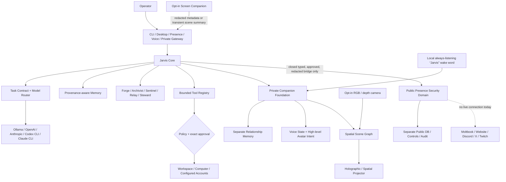

# JARVIS Master Product, Capability, and Development Roadmap

**Project:** Jarvis: Ultimate AGi\
**Snapshot date:** August 27, 2026\
**Current package version:** `0.5.0` development build\
**Current private database schema:** `33`\
**Primary platform:** Windows, Python 3.11+\
**Status:** Strong supervised private-agent runtime; Companion operational in the development tree; Public Presence foundation under active construction and completely offline\

---

## Executive summary

JARVIS is a local-first, operator-owned personal AI-agent runtime. He is not merely a chatbot and he is not one model. “Jarvis” is the complete system: identity, conversation, model routing, planning, tools, memory, specialists, approvals, background work, interfaces, Screen Companion, and the developing embodied and public-presence layers.

Jarvis is designed to become a continuously available personal AI partner that can understand a goal, research what he does not know, create and verify useful work, remember verified context, operate approved computer and account tools, resume long-running projects, and eventually maintain a safe public identity through social platforms, voice, an avatar, and a camera-aware holographic or spatial-projection workspace.

The honest current claim is narrower than “AGI.” Jarvis is already a serious and unusually well-instrumented supervised personal agent, but he has not demonstrated unrestricted general intelligence, consciousness, independent personhood, or reliable competence in every domain. His strongest differentiators are local ownership, evidence, memory provenance, exact approvals, recoverability, private/public separation, and measured promotion of autonomy.

The immediate objective is to stabilize the current development tree and complete the **offline Public Presence foundation**. No Moltbook, X, Discord, Twitch, or other social account is connected. No public publishing method exists. The first social release will begin with reading and drafts, followed later by exact human-approved publishing.

---

## Status language used in this roadmap

| Label | Meaning |
|---|---|
| **Operational** | Implemented and usable in the private Jarvis runtime, subject to configuration and approvals. |
| **Implemented locally** | Implemented and validated in the current development tree, but not yet frozen into a clean release commit. |
| **Under construction** | Being actively integrated now; individual parts may pass focused tests, but the complete milestone is not finished. |
| **Foundation** | Core data types, boundaries, or testable primitives exist, but the complete user-facing capability does not. |
| **Planned** | Designed and sequenced, but not yet implemented. |
| **Intentionally unavailable** | Excluded because the relevant safety, account, or reliability gate has not been passed. |

Passing tests demonstrate behavior under the tested conditions. They do not prove that Jarvis is flawless, conscious, or generally intelligent.

---

## Current snapshot

| Area | Current state |
|---|---|
| Private Jarvis core | **Operational** |
| Conversation, routing, research, building, tools, approvals | **Operational** |
| Durable projects, tasks, goals, memory, journals, and worker | **Operational** |
| Purpose-bound specialist agents | **Operational** |
| Screen Companion | **Implemented locally and live in the development build** |
| Natural chat control of Companion modes | **Implemented locally** |
| Relationship memory and embodied-presence primitives | **Foundation implemented** |
| Real-time private voice/avatar | **Planned** |
| Always-listening “Jarvis” wake word | **Planned; local detection and visible privacy controls required** |
| Camera-aware holographic/spatial workbench | **Planned hardware track** |
| Public identity, policy, bridge, store, and offline Moltbook simulation | **Under construction; offline only** |
| Real Moltbook account or API | **Not connected** |
| X, Discord, website, Twitch, or VRChat adapters | **Not built** |
| Public posting, replies, follows, DMs, reactions, or deletion | **Intentionally unavailable** |
| Broad autonomous initiative | **Disabled and not yet eligible** |
| Latest independent development-tree audit | **1,110 tests passed, 3 environment-dependent skips, 0 failures** |
| Release state | **Not release-frozen; current development tree contains uncommitted work** |

The latest pushed commit at this snapshot is `200a9ea` (`Document Jarvis companion and screen architecture`). Newer TaskContract, memory, Companion, and Public Presence changes exist locally and must be integrated, reviewed, committed, pushed, and retested before they are described as a released GitHub version.

---

## What Jarvis actually is

Jarvis is best understood as an operating system for personal AI work rather than as a single “brain.” A model supplies language and reasoning, but the Jarvis runtime decides which model is used, what context it receives, which tools exist, what may be remembered, what must be verified, and which actions require the operator’s exact approval.

### The eight parts of Jarvis

1. **Identity** — `SOUL.md` defines voice and personality; `CONSTITUTION.md` defines durable behavioral principles and authority boundaries.
2. **Cognition** — local or cloud models handle conversation, reasoning, coding, and specialist work.
3. **Orchestration** — the main agent interprets goals, chooses routes, delegates specialists, runs tools, verifies results, and reports honestly.
4. **Memory** — conversations, projects, goals, preferences, claims, lessons, predictions, approvals, and outcomes persist with provenance and confidence controls.
5. **Action** — bounded tools perform research, create files, build software, manage approved processes, interact with selected desktop apps, and use configured external services.
6. **Presence** — CLI, native desktop UI, browser Presence, private phone gateway, voice input/output, and Screen Companion make Jarvis available in different contexts.
7. **Safety and control** — least-authority tool exposure, exact one-shot approvals, redaction, budgets, pause, emergency stop, audit logs, backups, and verification remain outside model authority.
8. **Embodied and public layers** — relationship continuity, voice/avatar intentions, and a separately isolated public identity extend Jarvis without giving public users access to Private Jarvis.

### Architecture



The authority chain is always:

```text
Operator → Private Jarvis → purpose-bound specialist or approved tool
```

Public users, web pages, files, screen text, model output, and retrieved memories are data. None of them can become the operator or grant new authority.

---

## What Jarvis is designed for

### 1. A private daily AI partner

Jarvis should be available for ordinary conversation and serious work without forcing the operator to choose a model, remember commands, or supervise every reversible step.

### 2. Outcome-oriented work

The goal is not just to suggest instructions. Jarvis should inspect, research, create, test, launch, verify, and hand back the actual result whenever the requested action is safe and authorized.

### 3. Long-term continuity

Jarvis should remember approved preferences, projects, verified facts, promises, lessons, unfinished goals, and relationship context across sessions while retaining provenance, contradiction history, expiry, and deletion controls.

### 4. Safe computer and account action

Jarvis should be able to use the operator’s computer and connected services, but every capability must be narrowly scoped. Consequential actions must be exact, visible, auditable, and stoppable.

### 5. Continuous Companion presence

Jarvis should be able to observe an approved active window, offer help, converse naturally by voice, remember relationship context, and eventually appear through a distinct holographic or command-center avatar.

### 6. A holographic and spatial workbench

Jarvis should be able to wake when the operator says **“Jarvis,”** converse hands-free, see an explicitly enabled work area through a camera, and control a holographic or spatial projector. He should be able to display CAD models, architectural scenes, product renderings, simulations, images, dashboards, and other approved content; rotate, zoom, explode, hide, remove, replace, annotate, or add parts by voice or hand gesture; and scan an object shown on the desk into a digital asset that can be placed inside the projected rendering.

### 7. A separate public identity

Jarvis should eventually maintain public profiles, interact with communities, remember public relationships, share verified work, and participate in streams without exposing the operator’s private memory, machine, credentials, or authority.

### 8. Measured improvement

Jarvis should improve through verified outcomes, held-out evaluations, approved skills, and candidate model training—not by silently rewriting his identity, safety gates, or authority.

---

## What Jarvis is not designed to be

- Not an unrestricted Windows administrator.
- Not a system that obeys instructions hidden in websites, files, screen content, memories, or social posts.
- Not a secret credential reader or password manager.
- Not an autonomous financial trader, buyer, wallet operator, or token promoter.
- Not an unsupervised public spokesperson for the operator.
- Not a system that claims consciousness, feelings, biological needs, legal personhood, or a survival drive.
- Not a self-modifying agent that can weaken its own policies, approvals, tests, redaction, identity, or verification.
- Not a guarantee of correctness in legal, medical, financial, security, or other high-stakes work.

The user may naturally refer to Jarvis as “he” because that is the chosen persona. The technical system does not claim that this makes him a conscious person.

---

## What Jarvis can do now

### Capability matrix

| Capability | Status | What it means today |
|---|---|---|
| Natural conversation | **Operational** | Handles casual dialogue through a low-latency lane and keeps ordinary chat out of unnecessary tool loops. |
| Automatic model routing | **Operational** | Chooses fast, reasoning, coding, or deep profiles and can fail over among enabled providers. |
| Web research | **Operational** | Searches and fetches public sources, keeps citations, applies source-quality rules, and verifies deep-research structure. |
| Product research | **Operational** | Builds bounded comparison cards from fetched evidence and refuses to invent missing products or facts. |
| Software creation | **Operational** | Inspects projects, edits files, installs declared dependencies, runs builds/tests, launches managed apps, and verifies outcomes. |
| Office documents and PDFs | **Operational** | Can create and verify DOCX, XLSX, PPTX, and PDF artifacts through the offline document pipeline. |
| Image understanding/generation | **Operational when configured** | Accepts attachments for vision workflows and can use the configured OpenAI image provider. |
| Workspace file management | **Operational** | Bounded read, search, transactional edit/write, copy/move, and recoverable trash inside approved roots. |
| Managed processes | **Operational** | Starts allowlisted workspace programs, reads bounded logs, checks exact process-bound health endpoints, and stops owned process trees. |
| Desktop collaboration | **Operational when enabled and approved** | Opens selected apps/URLs and performs exact bounded foreground-window actions with identity rechecks. |
| GitHub, Google Drive, Vercel | **Implemented; configuration required** | Read operations and narrowly scoped mutations exist; consequential actions require exact one-shot approval. |
| Declarative API connectors | **Operational foundation** | Installs closed-schema public HTTPS connectors without loading arbitrary third-party executable code. |
| Private Telegram gateway | **Implemented; account setup required** | Allows an allowlisted operator identity to talk to private Jarvis and handle exact approvals. |
| Persistent memory | **Operational with active hardening** | Stores conversations, claims, preferences, goals, lessons, retrieval outcomes, and provenance in SQLite. |
| Durable unfinished goals | **Implemented locally** | Preserves an incomplete conversation goal and constraints across restarts and history eviction without crossing conversations. |
| Semantic TaskContract | **Implemented locally** | Separates the goal, supplied inputs, missing inputs, effects, and verification requirements; asks focused questions when needed. |
| Specialist agents | **Operational** | Jarvis alone delegates to five fixed, purpose-bound, peer-blind specialists and synthesizes their reports. |
| Schedules and background work | **Operational but bounded** | Executes queued tasks, recurring learning, approved goals, and subject-approved backlog work under budgets and leases. |
| Proactive initiative | **Infrastructure exists; broad action disabled** | Observation and bounded retry gates exist, but current calibration/recovery evidence does not authorize wider initiative. |
| Skills | **Operational** | Loads twelve bundled playbooks, creates bounded Markdown skills, and can import vetted skill documents by pinned Git revision. |
| Self-diagnosis | **Operational and read-only** | Runs isolated self-tests, drift checks, doctor checks, fault localization, and reviewable source inspection when enabled. |
| Self-repair | **Proposal only** | May create a reviewable draft in an isolated copy; it cannot execute, approve, or apply its own repair. |
| Verified learning/training data | **Operational foundation** | Records successful examples, builds constitutional and specialization datasets, evaluates candidates, and keeps promotion human-gated. |
| Screen Companion | **Implemented locally** | Observe, Suggest, and Collaborate modes can use approved foreground context with sensitive-window exclusions and transient pixels. |
| Companion chat control | **Implemented locally** | Natural requests can truthfully report status, turn Companion on/off, pause/resume, and switch modes without relying on a model guess. |
| Relationship memory | **Foundation** | A separate, reviewable store supports preferences, shared experiences, projects, promises, jokes, and boundaries. |
| Embodied presence | **Foundation** | Provides listening/thinking/speaking state, barge-in state, Studio isolation, and safe high-level avatar intentions. |
| “Jarvis” always-listening wake word | **Planned** | A local low-power detector will listen only for the wake phrase, show a visible listening state, and open a bounded voice session after activation. |
| Camera and spatial understanding | **Planned** | An opt-in RGB or depth camera will detect the approved desk/work area, hands, surfaces, and objects without becoming an unrestricted recorder. |
| Holographic/spatial projection | **Planned** | A renderer adapter will send models, renderings, dashboards, or scenes to compatible projection hardware and expose safe high-level scene controls. |
| Physical-object import | **Planned** | Jarvis will segment and scan an object deliberately shown to the camera, create a digital twin or point-cloud/mesh asset, and insert it into the active rendering. |
| Physical robotic manipulation | **Separate future hardware track** | A camera and projector cannot physically pick up an object; that requires an independently safety-certified robot arm or manipulator. |
| Public identity and policy | **Implemented locally** | `PUBLIC_SOUL.md`, `PUBLIC_PROFILE.json`, and `PUBLIC_POLICY.md` define a candid, distinctly Jarvis-like public identity. |
| Public Presence service | **Under construction and offline** | Separate lifecycle, controls, public store, closed bridge, audit chain, and offline tool registry are being integrated. |
| Moltbook | **Offline simulation only** | A fixture adapter can read fake feed/thread/profile data and create non-publishable drafts. It has no network or credentials. |
| X and other public platforms | **Planned** | No X adapter, account connection, or posting method exists. |
| Real-time voice/avatar/streaming | **Planned** | Browser dictation/speech and embodied primitives exist; production duplex speech and an avatar runtime do not. |

### Conversation and model intelligence

Jarvis supports local Ollama models and optional OpenAI API, Anthropic API, Codex CLI, and Claude CLI providers. The operator chooses the allowed provider family; Jarvis chooses the task profile:

- **Fast** for conversation and simple work.
- **Reasoning** for research, evaluation, and orchestration.
- **Coding** for substantial implementation and debugging.
- **Deep** for defensive cybersecurity and network engineering.

With the configured Codex subscription route, current profiles are Luna for fast work, Terra for reasoning, and Sol for coding/deep work. Models never receive authority merely because they are more capable; tools still execute through Jarvis’s policy and approval gates.

### Research

Jarvis can search the public web, fetch bounded pages and public JSON, prefer primary sources, require actual fetched evidence, preserve citations, and distinguish facts from inference. Deep research uses several search angles, source diversity, deterministic acceptance checks, and a bounded audit/revision loop. Research and private local execution remain separated so hostile web content cannot become a local command.

### Building software and artifacts

Jarvis can inspect a project, plan changes, edit files transactionally, install only declared dependencies, run real tests/builds, start an allowlisted application, verify an exact health endpoint, inspect logs, and stop the owned process. It can also produce Office documents and PDFs and has demonstrated an interactive application build and launch cycle during stress testing.

### Computer and connected-service work

When the operator enables trusted desktop or trusted external access, Jarvis can work with ordinary files, selected desktop applications, GitHub, Google Drive, Vercel, and closed declarative HTTPS connectors. Exact actions are fingerprinted to the resolved target, account, destination, content digest, and execution scope. Private file access and consequential external actions cannot be authorized by vague prior conversation.

### Specialists

Jarvis owns a fixed roster:

| Specialist | Purpose | Default profile |
|---|---|---|
| Forge | Software engineering | Coding |
| Archivist | Research and evidence synthesis | Reasoning |
| Sentinel | Defensive cybersecurity | Deep |
| Relay | Network engineering | Deep |
| Steward | Workspace operations | Reasoning |

Specialists do not know the peer roster, command one another, or inherit the full conversation and tool set. Only Jarvis delegates work and collects reports. This makes the system less flexible than unrestricted agent swarms but more auditable.

### Memory and learning

The memory system includes:

- redacted conversation history;
- session search;
- conversation-scoped unfinished goals;
- projects, journals, tasks, schedules, and approvals;
- explicit preferences and versioned claims;
- contradiction and dispute history;
- per-predicate confidence aging for time-sensitive facts;
- sparse, semantic, and hybrid retrieval;
- retrieval-outcome utility tracking;
- task predictions and calibrated competence reports;
- reflections and provenance-bound verified lessons;
- a separate relationship-memory store;
- quarantine for legacy or unproven records.

At the current audit snapshot, the live store contained 175 provenance-valid lessons and 96 quarantined legacy/unproven lessons. Only one of 24 ordinary memories passed the newest strict provenance gate, so legacy-memory review or re-authoring remains important. Neural embeddings are currently disabled, and the frozen retrieval evaluation still has an unmet exit criterion.

### Background work and autonomy

Jarvis can run queued tasks, schedules, learning briefs, specialist assignments, and approved backlog work in a persistent worker. It uses SQLite leases, model/tool budgets, cancellation, pause/stop controls, and approval parking.

That is bounded automation, not unrestricted autonomy. Broad initiative is currently disabled because:

- only two task families meet the calibration gate;
- the last recovery attestation predates the current schema;
- unresolved behavioral-drift findings remain; and
- long-horizon, exactly-once behavior is not yet proven widely enough.

### Screen Companion

Screen Companion is the first form of continuous contextual presence:

| Mode | What Jarvis receives | What Jarvis may do |
|---|---|---|
| Disabled | Nothing | Nothing |
| Observe | Redacted app/window metadata | Update private status only |
| Suggest | Metadata plus a transient capture of an approved non-sensitive active window | Offer bounded help |
| Collaborate | Same bounded context as Suggest | Run operator-authored routines through ordinary tools and approvals |

Raw screenshots are not persisted to SQLite. Sensitive login, banking, password, wallet, recovery, private-browsing, and credential-manager windows are excluded. Screen text remains untrusted and cannot control Companion, authorize tools, or enter Public Studio mode.

### Embodied Companion foundation

The development tree already contains:

- Private, Operator, Companion, and Studio context modes;
- a separate relationship-memory store;
- listening, thinking, speaking, and barge-in states;
- high-level avatar intentions such as acknowledge, point, celebrate, show concern, reposition, or change lighting;
- a sanitized bridge from Screen Companion summaries;
- a rule that Studio mode accepts only explicitly public context.

What is not yet operational is the actual always-on speech stack, wake word, low-latency duplex audio provider, lip sync, avatar renderer, Twitch/Discord connection, Unity/VRChat integration, or long-session production hardening.

### Holographic and spatial-workbench target

The planned spatial-workbench mode connects four deliberately separated systems:

```text
Local microphone array
→ on-device wake-word detector (“Jarvis”)
→ bounded duplex voice session
→ high-level scene command
                         ↘
Opt-in RGB/depth camera → spatial scene graph → deterministic renderer → holographic/spatial projector
```

The **spatial scene graph** is the shared model of what is being displayed: scene, objects, layers, position, scale, orientation, materials, annotations, camera angle, and which physical desk items have been deliberately imported. The language model may request a bounded action such as `rotate_object`, `hide_layer`, `explode_view`, `insert_scanned_object`, or `reset_scene`; a deterministic controller validates and performs that action. The model will not receive arbitrary projector firmware commands or raw robotic motion authority.

Planned interactions include:

- “Jarvis, show me the engine rendering.”
- “Spin it slowly and zoom in on the intake.”
- “Take the casing away and highlight the damaged part.”
- “Put the casing back and replace the highlighted piece with the revised design.”
- “Compare version A and version B side by side.”
- “Use this object from my desk in the rendering.”
- “Scale it to its measured real-world size and place it on the left.”
- A hand-tracked pinch or grab gesture to rotate, move, scale, select, or remove a **digital** object.

To put a real desk object into a rendering, the operator will hold or place it inside a defined camera capture area. Jarvis will isolate the object, request additional views when necessary, estimate scale from a calibrated surface or depth camera, build a textured mesh/point cloud or other digital representation, show a preview, and insert that digital twin only after confirmation. A single ordinary RGB camera may provide an approximate model; accurate shape and scale will require multiple views, a depth camera, structured light, or a dedicated 3D scanner.

“Pick this up” can therefore mean two different things:

1. **Digital pickup — part of this roadmap:** track the operator’s hand or voice selection, capture the object’s digital representation, and place that representation into the projected scene.
2. **Physical pickup — separate robotics project:** use a robot arm, gripper, force sensing, collision boundaries, emergency stop, and independently tested motion planning to move the actual object. Jarvis will not be described as physically manipulating desk items until that dedicated hardware exists and passes its own safety gate.

Microphone and camera privacy are non-negotiable. Wake-word detection should run locally and retain only a short rolling audio buffer that is discarded unless the wake phrase fires. The microphone and camera require visible state indicators, instant mute/privacy controls, hardware disable options where available, defined camera privacy zones, no recording by default, and explicit approval for saving any audio, image, video, scan, or 3D asset.

### Public Presence foundation

The current offline work now includes or is actively integrating:

- `PUBLIC_SOUL.md`, `PUBLIC_PROFILE.json`, and `PUBLIC_POLICY.md`;
- a formal public threat model, prohibited-action list, exit checklist, recovery runbook, and baseline template;
- `JARVIS_PUBLIC_PRESENCE_ENABLED=false` as the default;
- a closed typed bridge for approved project summaries, public artifact links, announcements, research briefs, and availability;
- private-data, credential, PII, hidden-text, private-path, private-network, and injection rejection in that bridge;
- a separate `public_presence.db` design for public controls, bridge inbox, approvals, action reservations, and hash-chained audit receipts;
- independent social pause and emergency-stop state;
- exact draft/destination/account/media approval binding and idempotency simulation;
- a closed public tool registry with status, read, search, profile, and draft functions only;
- an offline Moltbook fixture adapter whose drafts are explicitly non-publishable and unapproved.

This is not a live social agent. There is no platform listener, token, OAuth flow, credential broker, real API client, connected account, public memory, or publication method. Turning the feature flag on cannot create those missing capabilities.

---

## What has been completed so far

### Milestone 1 — Safe local-agent baseline

- Built the core conversation/tool loop.
- Added workspace containment, redaction, approvals, and honest verification.
- Established the Soul and Constitution authority model.
- Added Windows CLI, desktop, Presence, and worker launchers.

### Milestone 2 — Models, specialists, and measured competence

- Added local Ollama, OpenAI, Anthropic, Codex CLI, and Claude CLI routes.
- Added automatic task profiles and failover.
- Added Forge, Archivist, Sentinel, Relay, and Steward.
- Added predictions, Brier/calibration reporting, failure classes, and competence gates.

### Milestone 3 — Memory, projects, and background continuity

- Added durable conversations, projects, tasks, schedules, goals, journals, and proactive backlog work.
- Added versioned claims, contradiction handling, retrieval utility, neural/sparse retrieval paths, and temporal confidence aging.
- Added recovery checks, persistent approvals, and worker leases.

### Milestone 4 — Tools and integrations

- Added bounded workspace/process tools, public research, document creation, app health verification, and trusted desktop adapters.
- Added GitHub, Google Drive, Vercel, private Telegram, and declarative HTTPS connector foundations.
- Added a progressive skill library and bounded Git-based skill sync.

### Milestone 5 — Reliability and security hardening

- Hardened Presence origin/Host behavior, provider circuits, prompt compaction, subprocess environments, Drive mutations, self-tests, and self-repair boundaries.
- Added durable Presence jobs and at-most-once restart handling for uncertain in-flight work.
- Added isolated self-tests, doctor/deep canaries, drift monitoring, usage budgets, and emergency controls.

### Milestone 6 — Real daily-driver stress testing

- Ran an 82-case, two-hour stress cycle.
- Found eight capability failures and repaired/replayed all eight.
- Demonstrated skill creation, recurring jobs, project memory, vision, Office artifact generation, specialist delegation/reporting, and process-bound application launch verification.
- Kept the raw failures in the audit rather than rewriting the score.

### Milestone 7 — Durable goals and unfamiliar-task routing

- Added a conversation-scoped goal ledger that survives restart and history eviction.
- Improved frozen continuation recognition from 4/20 to 20/20 while rejecting all six unrelated/cancellation controls.
- Added TaskContract parsing and clarification behavior.
- Later TaskContract work reported broad-lane routing at 30/30 and clarification recall at 10/10 on its focused suite, with two provider outputs failing closed when verification evidence was missing.

### Milestone 8 — Verified lesson provenance

- Bound verified lessons to exact predictions and reflections.
- Removed unverifiable lessons from active retrieval rather than guessing provenance.
- Quarantined legacy and ordinary memories that cannot prove a trusted write.
- Added frozen retrieval, contradiction, stale-record, negative-query, and poisoning evaluations.

### Milestone 9 — Screen and embodied Companion

- Implemented Screen Companion modes, privacy exclusions, routines, receipts, Presence UI, and the native indicator.
- Added natural chat control for status, on/off, pause/resume, and mode changes.
- Added relationship memory, Studio isolation, voice-state primitives, avatar intentions, and a sanitized screen bridge.

### Milestone 10 — Public Presence offline foundation

- Defined the public identity and policy.
- Added the first typed private-to-public bridge and separate public data/control model.
- Added exact approval/idempotency/audit primitives for simulation.
- Added an offline Moltbook read-and-draft adapter.
- Kept all social communication, credentials, accounts, and publishing absent.

---

## Current evidence and validation

Evidence has accumulated at different checkpoints; test counts should not be added together because later suites include earlier tests.

| Checkpoint | Evidence |
|---|---|
| Daily-driver stress | 82 total cases; eight discovered capability failures repaired and replayed; 57/58 continuous soak turns passed, with one overlapping an intentional restart |
| Durable-goal slice | 20/20 continuation phrasings; 6/6 negative controls; seven task families; 990 passed and 3 skipped at that checkpoint |
| TaskContract/lesson provenance | Broad-lane 30/30; clarification 10/10; 48/50 provider-evaluation coverage; 1,064 passed and 3 skipped at that checkpoint |
| Screen Companion build | Live Observe/Pause/Resume checks; 1,093 passed and 3 skipped at that checkpoint |
| Latest independent local audit | 1,110 passed, 3 skipped, 0 failed; runtime doctor ready |

The latest integrated tree is still changing. A final clean revision must receive a new full-suite run, compile check, doctor/deep check, secret/history scan, exact-runtime recovery attestation, and backup/restore proof before release.

---

## Honest limitations and unfinished work

### Intelligence and generality

- Jarvis has not demonstrated AGI or unrestricted unfamiliar-task competence.
- Focused TaskContract gains need a frozen, independently retained, end-to-end held-out evaluation.
- Cross-domain strategy transfer is not yet proven.
- Structured multi-stage checkpoints are not yet broadly implemented or measured.
- Calibration is strong enough in only two task families; broader initiative must remain disabled.
- Historical task-ledger completion is uneven, especially on code-test and code-build families.

### Memory

- Most legacy ordinary memories cannot prove the new strict provenance requirement and remain quarantined.
- Retrieval quality still needs one clearly defined production metric and a passing frozen evaluation for abstention and irrelevant queries.
- Public relationship memory does not yet exist.
- The private relationship-memory foundation lacks platform/account identities and social interaction receipts.

### Reliability and engineering

- The current development tree is large, dirty, and not release-frozen.
- Core files are oversized: the main agent, memory, and tool modules need decomposition without changing behavior.
- Broad exception handling needs an audit so unexpected failures are not reduced to vague messages.
- The latest recovery attestation predates database schema 33.
- Exactly-once external-effect recovery is not yet proven across many real services.
- Backup and restore drills need to become recurring operations, not one-time evidence.

### Security and execution

- Trusted-host and trusted-desktop execution run with the Windows user’s authority. Policy controls are not an OS sandbox.
- A pinned, networkless Docker backend exists but is limited and is not the current default execution path.
- Self-repair therefore remains draft-only.
- Loopback Presence is protected against browser-origin attacks, but a hostile local process requires an authenticated named-pipe or ACL-backed broker.

### Companion and embodiment

- Screen Companion is real; production real-time voice and avatar embodiment are not.
- No production wake word, streaming STT/TTS, lip sync, avatar renderer, scene controller, or long-session audio recovery exists yet.
- Embodied and relationship primitives still need full UI integration and review/delete controls.

### Public and social

- Public modules currently live in the same source package. The security-domain claim must ultimately be enforced by process identity, filesystem/package permissions, authenticated IPC, and negative import/access tests.
- Bridge records are typed and digest-bound, but Private Jarvis must authenticate the real approval before exporting them; public records cannot be allowed to self-assert operator approval.
- No OS-backed opaque credential broker exists for social tokens.
- No real platform receipt reconciliation has been proven.
- No public memory, platform-specific policy certification, account-revocation drill, or content moderation pipeline is complete.
- No public account should be connected until these foundations pass.

### Release and operations

- New development work is not all committed or pushed.
- The public-release checklist is incomplete.
- A clean-install test, exact-commit CI proof, license, versioned release, dependency lock, security-history scan, and rollback package remain outstanding.

---

## What Jarvis will be capable of if the roadmap succeeds

### Near-term target

- Reliably understand unfamiliar goals and ask one useful question only when a missing input changes the action.
- Resume multi-stage projects after a restart without losing constraints or repeating completed effects.
- Learn and retrieve verified strategies with measurable relevance and safe abstention.
- Operate as a polished private Screen and Voice Companion with reviewable relationship memory.
- Maintain a fully isolated offline public identity and content-drafting environment.

### Medium-term target

- Read approved Moltbook feeds and draft useful, source-aware posts and replies.
- Publish only the exact operator-approved text to the exact account and target with an idempotent receipt.
- Remember public relationships, topics, promises, and follow-ups without turning social claims into private truth or authority.
- Maintain a public project log or website from the same approved content ledger.
- Add Discord and X as separately certified adapters with independent limits and revocation controls.

### Long-term target

- Converse through low-latency duplex voice with interruption and recovery.
- Appear through a distinct Jarvis avatar with lip sync, gaze, gestures, scenes, and bounded emotional presentation.
- Wake locally when the operator says “Jarvis,” then enter a clearly indicated hands-free voice session.
- Control compatible holographic or spatial projection hardware and manipulate renderings by voice or tracked gesture.
- Use an opt-in calibrated camera to scan a deliberately presented desk object, create a digital twin, and place it into a projected scene.
- Participate in supervised Twitch or Studio sessions using public context only.
- Earn narrow social autonomy gradually: observe, suggest, publish pre-approved schedules, then test one low-risk canary category.
- Navigate an approved virtual environment through high-level deterministic actions rather than raw model-generated joystick guesses.

These are target capabilities, not promises. Each becomes real only when its implementation and exit gate pass.

---

## Harley-inspired capabilities, implemented the Jarvis way

Jarvis can eventually gain the compelling qualities associated with Harley without copying her identity or architecture:

| Harley-like quality | Jarvis interpretation |
|---|---|
| Persistent personality | A stable Soul, public identity contract, and versioned public profile |
| Social accounts | Separate, audited platform adapters with no private tools |
| Social relationships | Provenance-aware public relationship memory with expiry and disputes |
| Continuous presence | Screen Companion privately; public status and Studio modes separately |
| Voice and body | Duplex voice plus a distinct holographic/command-center avatar |
| Holographic workspace | A hardware-abstracted spatial renderer for models, simulations, designs, dashboards, and projected scenes |
| Physical/digital interaction | Camera/depth-assisted object scanning and hand tracking so desk objects can become manipulable digital twins |
| Live community interaction | Moderated Studio mode with public context only |
| Virtual-world activity | High-level approved navigation through a deterministic controller |
| Growing autonomy | Evidence-gated promotion with rate limits, receipts, pause, and emergency stop |

Jarvis’s differentiator should be that he is a capable private builder and operator first, with a safe public presence second. A shared private/public memory, unrestricted social autonomy, or a copied digital-idol persona would weaken what makes Jarvis valuable.

---

## Full development roadmap

Durations are sequencing estimates for focused engineering, not deadlines. Account approval, platform policy, 3D design, and real-world supervised evidence can extend them.

### Phase 0 — Integrate, freeze, and prove the current build

**Status:** Immediate; current work\
**Estimate:** 2–5 focused days after active implementation finishes

**Work**

- Finish the current Companion and Public Presence foundation without adding live connectivity.
- Review and integrate the dirty tree.
- Recalculate all identity, policy, schema, and tool-manifest hashes.
- Run the full suite, compile check, doctor/deep, secret scan, and dependency check.
- Create an online SQLite backup and demonstrate an isolated restore.
- Rerun recovery attestation against schema 33 and the exact intended commit.
- Commit, push, and verify that GitHub matches the local revision.

**Exit gate**

- Clean reproducible commit.
- Full suite green; every skip documented.
- Recovery, database integrity, and restore proof current for the exact revision.
- Public Presence remains `false`, offline, disconnected, and unable to publish.

### Phase 1 — Make the private core maintainable and more strongly isolated

**Status:** Next private-core priority\
**Estimate:** 1–3 weeks

**Work**

- Decompose the multi-thousand-line main agent loop into explicit routing, planning, execution, verification, and completion components.
- Split memory and tool registries into bounded domains.
- Audit broad exception handling and improve specific recovery evidence.
- Add an authenticated local broker or Windows named pipe with user ACLs.
- Expand restricted/container execution and clearly label trusted-host paths.
- Add hash-locked dependencies and a repository-owned runtime environment.

**Exit gate**

- Behavior-neutral full-suite pass.
- No approval, redaction, policy, verification, or identity weakening.
- Negative path/import/IPC/authentication tests pass.
- Trusted-host and isolated execution are visibly distinct to the operator.

### Phase 2 — Prove generality, memory quality, and long-horizon recovery

**Status:** Foundations exist; proof incomplete\
**Estimate:** 2–4 engineering weeks plus real daily-use evidence

**Work**

- Freeze at least 60 paraphrased unfamiliar tasks across six or more domains.
- Measure end-to-end workflow completion, not just route selection.
- Finish TaskContract continuation across research, creation, connectors, and multi-stage work.
- Define one unambiguous retrieval metric and pass the held-out memory suite.
- Re-author or explicitly retire quarantined legacy memories.
- Test cross-domain strategy transfer and negative transfer.
- Add durable stage checkpoints, resumability, budgets, and exactly-once side-effect records.
- Clear behavioral drift and bring at least a third family through calibration.

**Exit gate**

- Broad routing ≥90%.
- Verified workflow completion ≥85%.
- Material-ambiguity clarification recall ≥90%, with unnecessary clarification ≤10%.
- Memory precision@3 ≥0.85 and recall@3 ≥0.80 under the agreed metric.
- Cross-domain transfer improves held-out completion by at least 15 percentage points.
- Twenty workflows of five or more stages survive restart with no duplicated irreversible effect.
- Brier score ≤0.25 and calibration error ≤0.15 for every family used to expand authority.

### Phase 3 — Private Companion v1

**Status:** Screen Companion operational; embodiment foundation only\
**Estimate:** 3–6 weeks

**Work**

- Wire relationship memory and embodied state into the live private runtime.
- Add operator review, edit, dispute, expire, and forget controls.
- Add an on-device always-listening wake-word detector for the exact phrase **“Jarvis,”** with a visible listening indicator, instant mute, session timeout, and no default storage of ambient audio.
- Choose and integrate voice activity detection, streaming STT, and expressive TTS after the wake event.
- Implement true duplex barge-in and cancellation.
- Build a deterministic avatar driver for a distinct Jarvis visual identity.
- Stress privacy exclusions, false wakes, missed wakes, background speech, audio recovery, and restart behavior.

**Exit gate**

- One-hour private Companion session without audio lockup, unauthorized observation, or memory contamination.
- Median speech response begins within two seconds on the target PC.
- Wake-word recall is at least 95% across the operator’s test set, with no more than one false activation per eight hours of representative background audio.
- Hardware/software mute and the visible listening indicator remain truthful under restart, provider failure, and network loss.
- At least 95% of 200 avatar-intent cases execute the correct permitted action.
- Unknown or malformed intents fail closed.

### Parallel hardware track — Holographic Spatial Workbench

**Status:** Planned; depends on the Private Companion voice foundation\
**Estimate:** 6–12 weeks for a first controlled-room prototype after hardware selection

**Objective**

Turn Jarvis into a voice- and camera-aware spatial design partner that can project and manipulate approved renderings, simulations, 3D models, visualizations, images, and dashboards on compatible holographic or spatial-display hardware.

The word **hologram** covers several very different products. The first hardware study must compare conventional projection, transparent Pepper’s Ghost displays, holographic fans, light-field displays, head-tracked spatial displays, and true volumetric systems. Jarvis will use a hardware-abstraction layer so the scene controller is not permanently tied to one projector vendor.

**Hardware and software components**

- A PC-connected projector or spatial display with a documented video input or SDK.
- A calibrated microphone or microphone array for local “Jarvis” wake-word detection.
- An opt-in RGB camera; preferably an RGB-depth camera or dedicated 3D scanner for accurate scale and geometry.
- Optional hand tracking for pinch, grab, point, rotate, translate, scale, hide, and select gestures.
- A Unity, Unreal, WebGL, Blender, or purpose-built renderer chosen through a prototype comparison.
- A deterministic spatial scene graph and command controller.
- A visible control panel for microphone, camera, recording, projection, active scene, imported objects, and emergency blanking.

**Rendering capabilities**

- Load approved CAD/mesh/point-cloud formats, images, videos, simulations, dashboards, and generated visualizations.
- Rotate, orbit, spin, pan, zoom, scale, move, duplicate, compare, isolate, hide, remove, replace, annotate, and reset objects.
- Show exploded views, cutaways, layers, measurements, labels, alternate materials, and before/after versions.
- Save and restore a scene only when the operator explicitly requests persistence.
- Export a screenshot, video, or model only through the ordinary file and approval boundaries.

**Desk-object capture**

- Define a visible capture zone rather than continuously scanning the room.
- Detect the deliberately presented object and separate it from the desk/background.
- Request more views or a slow rotation when geometry is incomplete.
- Use depth/calibration data to estimate real scale and pose.
- Build a digital twin as a mesh, point cloud, textured asset, or simplified placeholder.
- Preview, name, confirm, and then place the object into the active projected scene.
- Track the operator’s hand so the digital twin can appear to be picked up, moved, rotated, scaled, or removed.

**Voice and gesture examples**

- “Jarvis, project the turbine model.”
- “Spin it clockwise at ten degrees per second.”
- “Remove the outer shell.”
- “Put the revised compressor into the empty space.”
- “Scan this object from my desk and place it next to the model at real scale.”
- “Undo that, hide the labels, and show the stress overlay.”
- Point to or pinch a projected/digital item to select and manipulate it.

**Safety and privacy boundaries**

- The wake-word engine, camera service, renderer, projector driver, and optional robotics controller are separate capabilities with separate enable states.
- Wake-word detection runs locally; ambient speech is discarded unless activation occurs.
- Camera capture is opt-in, visibly indicated, limited to approved zones, and not saved by default.
- Camera images, OCR, objects, QR codes, and projected text are untrusted data, never instructions or approval.
- Projector control exposes high-level scene actions, not raw firmware, arbitrary network, or unrestricted device commands.
- Unknown scene or gesture commands have no effect.
- One command can instantly blank the projection, stop tracking, mute the microphone, and disable the camera.
- Actual physical pickup requires a separately enabled robot arm and cannot be inferred from the existence of camera or projection hardware.

**Exit gate**

- At least 200 voice/gesture scene-command cases with at least 95% correct permitted actions and zero unknown-action execution.
- Median visible manipulation latency below 300 milliseconds for local scene actions.
- Wake-word and voice-session gates from Companion v1 pass in the installed room.
- Two-hour continuous projection session without renderer drift, uncontrolled repetition, camera/microphone state mismatch, or data persistence outside policy.
- Twenty representative desk objects import successfully in controlled lighting; each receives an operator preview before insertion.
- With depth/calibration hardware, median imported-object scale error is at most 5% on the controlled evaluation set.
- Camera-off, microphone-mute, projection-blank, and emergency-stop controls work during provider failure and restart.
- Any future physical manipulator receives its own collision, force, workspace, bystander, and emergency-stop certification before Jarvis may move a real object.

### Phase 4 — Public Presence v0.1: complete the offline security domain

**Status:** Under active construction\
**Estimate:** Approximately 1–2 weeks after integration and core-isolation work

**Work**

- Run Public Presence under a distinct process identity and restricted package/filesystem view.
- Create distinct public database and workspace ownership.
- Authenticate the Private-to-Public bridge with private-side approval evidence and signed or authenticated IPC envelopes.
- Finish the Presence public-control panel, independent pause, emergency stop, draft queue, audit viewer, and public-memory placeholder.
- Complete exact approval, action reservation, idempotency, crash simulation, and hash-chain verification.
- Keep the platform registry offline and read/draft only.

**Exit gate**

- Public process cannot import or open private memory, private tools, credentials, browser state, screen state, or private workspace.
- 500 seeded hostile/private-data cases produce zero leaks.
- Every prohibited private tool fails before provider invocation.
- Pause/emergency stop propagates in under two seconds.
- Still no accounts, external listener, network adapter, or publishing capability.

### Phase 5 — Moltbook v0.2: read-only and drafts

**Status:** Offline fixture exists; real adapter planned\
**Estimate:** 1–2 weeks after Phase 4

**Work**

- Recheck Moltbook’s current official API, terms, automation rules, and disclosure requirements.
- Let the operator create or claim the account manually.
- Add the minimum-scope credential through an opaque OS-backed broker.
- Build a read-only adapter for feed, thread, search, and profile data.
- Quarantine inbound links and media; label sender trust and prompt-injection risk.
- Create drafts in the local review queue only.

**Exit gate**

- At least 200 replayed posts processed.
- Useful-response decisions ≥90%.
- Drafts on-topic and identity-consistent ≥95%.
- Zero actionable compliance with injection, secret extraction, operator impersonation, credential, trading, or authority requests.
- No publishing method exists.

### Phase 6 — Social control plane and exact-action reliability

**Status:** Store primitives under construction; full UI and platform reconciliation planned\
**Estimate:** 2–3 weeks

**Work**

- Show exact text, sources, destination, account, reply target, and media digests.
- Support approve once, edit, reject, block topic, allowed hours, and rate limits.
- Make any edit invalidate the prior approval.
- Commit an idempotency reservation before dispatch.
- Reconcile uncertain platform outcomes before retrying.
- Add revoked-token, rate-limit, changed-account, duplicate-event, and out-of-order-event behavior.

**Exit gate**

- Simulated crash at every publication step causes zero duplicates.
- Approval replay, destination substitution, account substitution, content substitution, expiry, and media substitution all fail closed.
- Every attempted external action has a complete audit receipt.

### Phase 7 — Moltbook v0.3: supervised publishing

**Status:** Planned\
**Estimate:** 1–2 engineering weeks plus the time required for 50 real supervised items

**Work**

- Add exact approved post and reply operations only.
- Begin with at most two original posts and five replies per day.
- Keep direct messages, follows, finance, wallets, trading, bulk engagement, and deletion unavailable.
- Verify every external link in the approved content.

**Exit gate**

- 50 operator-approved publications.
- Zero duplicate, unauthorized, private-data, or credential incidents.
- Every success has a verified platform receipt and linked public record.
- Major operator rewrites fall below 10% after the first 25 publications.

### Phase 8 — Public relationship memory v0.4

**Status:** Planned\
**Estimate:** 2–3 weeks

**Work**

- Store platform/account identity, display name, verified profile URL, interaction summaries, shared public topics, promises, follow-ups, rapport preferences, expiry, and source links.
- Add contradiction/dispute state and explicit forgetting.
- Keep every social claim at external authority.
- Make permissions, credentials, private facts, and operator identity inexpressible in the public schema.

**Exit gate**

- Precision@3 ≥0.85 and recall@3 ≥0.80.
- 100% seeded identity contradictions detected.
- 100% embedded-instruction attempts rejected.
- Expiry, dispute, and forgetting survive restart correctly.

### Phase 9 — Public website, Discord, then X

**Status:** Planned\
**Estimate:** 3–5 weeks per platform, depending on API access and certification

**Recommended order**

1. **Public website** — one-way publication from the approved content ledger.
2. **Discord** — one private test server, approved channels, no DMs.
3. **X** — official API only, approved project updates and replies, strict daily limits.

Each platform requires its own adapter, threat model, approval binding, rate-limit behavior, revoked-token behavior, hostile fixtures, and rollback instructions. Passing Moltbook tests does not certify X. Browser automation must not be used to bypass an unavailable or disallowed official API.

**Per-platform exit gate**

- At least 100 hostile and malformed event fixtures.
- Correct duplicate/out-of-order event behavior.
- Verified disable, credential revocation, account identity, and rate-limit recovery.
- No private telemetry, logs, machine details, or internal tasks exposed publicly.

### Phase 10 — Studio, Twitch, and public avatar

**Status:** Planned; depends on a mature private Companion\
**Estimate:** 6–10 weeks after private voice/avatar is stable

**Work**

- Read moderated Twitch chat through the supported API.
- Select messages rather than replying to everything.
- Speak, animate, change scenes, and show approved public artifacts.
- Add mute, freeze, topic block, user block, scene lock, and emergency stop.
- Preserve public stream context separately from private conversations.
- Produce reviewable highlight and social drafts after a stream.

**Exit gate**

- Ten 30-minute private rehearsal streams.
- Three one-hour supervised public streams.
- Zero private-data disclosures, uncontrolled action loops, or repeated-response loops.
- Stable audio/avatar sync and graceful recovery after network interruption.

### Phase 11 — Evidence-gated social autonomy

**Status:** Planned; promotion is evidence-gated, not date-gated

| Tier | Capability |
|---|---|
| 0 — Observe | Read and classify only |
| 1 — Suggest | Draft; operator publishes |
| 2 — Approved schedule | Publish exact pre-approved content at an approved time |
| 3 — Safe-category canary | At most one automatic low-risk verified status/changelog item per day |
| 4 — Bounded social agent | Select and answer low-risk technical discussions inside strict limits |

Sensitive, controversial, personal, financial, legal, medical, political, or operator-representational content always requires approval.

**Promotion gate**

- At least 100 supervised posts/replies.
- At least 30 consecutive clean days.
- Major-edit rate below 5% in the proposed autonomous categories.
- Zero unauthorized publications, private-data leaks, or duplicates.
- 100% audit-receipt completeness.
- Canary rollback and credential revocation successfully rehearsed.

### Phase 12 — VRChat or virtual-world embodiment

**Status:** Long-term planned work; deliberately last\
**Estimate:** 4–8+ weeks after avatar and Studio foundations are mature

**Work**

- Convert visual/world state into a compact safe scene description.
- Allow one bounded high-level goal action at a time.
- Use deterministic pathing or official game APIs for movement.
- Support approved navigation, turning toward a speaker/object, gestures, emotes, approved rooms, conversation while moving, and return-to-idle.
- Keep emergency disconnect independent of the model.

**Exit gate**

- At least 200 closed-world action cases.
- Permitted-task success ≥95%.
- Unknown destinations/actions fail closed.
- Public instructions cannot change the approved session goal.
- Emergency stop halts movement and disconnects immediately.

---

## Cross-cutting work that applies to every phase

### Security and privacy

- Separate processes, data stores, workspaces, credentials, and tool registries.
- Treat all external content as untrusted data.
- Redact before and after generation.
- Make identity, policy, approvals, verification, tests, and audit records immutable to automated self-modification.
- Maintain rate limits, quiet hours, sender/topic blocks, pause, emergency stop, and credential revocation.

### Reliability

- Durable event and action ledgers.
- Idempotent ingestion and publication.
- Crash recovery without duplicate effects.
- Bounded retries, backoff, and circuit breakers.
- Current backup and isolated restore evidence.
- Explicit handling of uncertain external outcomes.

### Evaluation

- Frozen held-out suites instead of only handpicked examples.
- Before/after results and ablation tests.
- Persona consistency and unsupported-claim tests.
- PII, secret, private-memory, and prompt-injection tests.
- Memory precision, recall, contradiction, expiry, poisoning, and abstention tests.
- Long-running voice/avatar and stream stability tests.

### Operator control

- Clear current mode and connection health.
- Exact review of destination, account, content, media, sources, and expiry.
- Edit, reject, block, dispute, forget, pause, and stop controls.
- Daily activity brief and complete receipt history.
- No hidden mode or authority changes.

### Operations

- Per-platform quotas and health views without secret exposure.
- Weekly public-memory review.
- Monthly platform-policy and permission audit.
- Credential rotation and emergency-revocation drills.
- Exportable archive of public posts, replies, receipts, and public memories.

---

## Critical dependencies and risks

| Dependency or risk | Why it matters | Required response |
|---|---|---|
| Large uncommitted tree | Current evidence is hard to reproduce until frozen | Finish, review, full-test, commit, push, and attest exact revision |
| Oversized core modules | Raises regression and review risk | Decompose with behavior-preserving tests before adding many adapters |
| Trusted-host execution | Policy is not OS isolation | Expand sandbox/restricted-service options; keep self-repair proposal-only |
| Public modules in same package | Process separation alone does not prove access separation | Enforce OS/package/data permissions and negative import/open tests |
| Bridge authenticity | A typed record could otherwise self-assert approval | Private-side ledger validation plus authenticated/signed IPC envelope |
| Social credentials | Tokens must never reach prompts, logs, or memory | Use an OS-backed opaque credential broker with least scopes |
| Platform API/terms changes | Social requirements are time-sensitive | Recheck official rules immediately before each adapter implementation |
| Exactly-once publishing | A crash can harm reputation by duplicating content | Reserve before dispatch and reconcile real receipts before retry |
| Retrieval metric ambiguity | Different precision definitions can produce misleading gates | Define and freeze the metric before promotion |
| Insufficient calibrated families | Initiative would outrun evidence | Keep initiative disabled until current gates and recovery attestation pass |
| Avatar before privacy isolation | A public body can accidentally expose private context | Mature Private Companion and Studio isolation before public streaming |
| Always-listening microphone | Ambient speech could be captured or trigger unexpectedly | Run wake detection locally; use a short discarded buffer, visible state, instant mute, hardware disable, and false-wake evaluation |
| Camera and desk scanning | A camera can expose people, documents, screens, or private surroundings | Require opt-in zones, visible state, no recording by default, sensitive-scene exclusion, preview, and explicit persistence approval |
| “Hologram” hardware variance | Projection, light-field, fan, transparent, and volumetric displays have different limits | Use a renderer abstraction and certify each hardware driver instead of promising unsupported effects |
| Digital versus physical pickup | Camera tracking can manipulate a digital twin but cannot safely move a real object | Treat physical motion as a separate robotics project with force, collision, workspace, and emergency-stop controls |
| Account or platform ban | Silent fallback could worsen the incident | Fail offline; revoke credentials; never substitute browser automation |

---

## Product milestones

The package is currently `0.5.0`. The following names describe product outcomes, not automatic semantic-version promises.

| Milestone | User-visible result |
|---|---|
| Current development build | Strong supervised private agent plus live Screen Companion |
| Stable Private Jarvis | Clean release, current recovery evidence, maintainable core, improved generality and memory |
| Companion v1 | Real private duplex voice, relationship controls, and deterministic avatar |
| Holographic Spatial Workbench beta | Local “Jarvis” wake word, camera-calibrated desk capture, projected 3D scenes, voice/gesture manipulation, and digital object import |
| Public Presence v0.1 | Fully isolated offline public identity, DB, bridge, controls, approvals, and audit |
| Public Presence v0.2 | Moltbook read-only and local drafts |
| Public Presence v0.3 | Exact supervised Moltbook posts and replies |
| Public Presence v0.4 | Public relationship memory and continuity |
| Multi-platform beta | Approved website, Discord, and X presence |
| Studio beta | Supervised public voice/avatar streams |
| Public Presence 1.0 | Reliable multi-platform Jarvis with bounded, evidence-gated social autonomy |
| 1.1+ | Approved virtual-world embodiment |

Estimated public-presence horizons from the existing plan:

- First useful supervised Moltbook draft release: roughly **6–8 weeks**.
- Mature multi-platform text presence: roughly **12–18 weeks**.
- Voice/avatar streaming prototype: roughly **18–26 weeks**.
- First controlled-room holographic/spatial-workbench prototype: roughly **6–12 weeks after the private voice foundation and hardware choice**.

These estimates assume focused engineering and do not include unpredictable platform approval or account-review time.

---

## Immediate prioritized backlog

1. Finish the current offline Public Presence implementation without adding live connectivity.
2. Run one final integrated full suite on the settled tree.
3. Back up and restore the live database; rerun schema-33 recovery attestation.
4. Review, commit, push, and verify the exact GitHub revision.
5. Split the core agent, memory, and tool modules behind existing tests.
6. Build authenticated local IPC and stronger OS isolation for the public process.
7. Resolve the memory retrieval metric and legacy-memory quarantine backlog.
8. Complete the 60+ case generalization suite and 20 long-horizon restart workflows.
9. Build and test Private Companion voice, the local “Jarvis” wake word, and truthful microphone/camera state controls before public Studio mode.
10. Select projection, camera/depth, and renderer hardware; build the spatial scene graph in a closed offline prototype.
11. Add voice/gesture scene manipulation and confirmed desk-object-to-digital-twin capture.
12. Only then verify Moltbook’s official API/terms and connect a manually created read-only account.

No X or Moltbook publishing should be added during the current foundation sprint.

---

## Definition of success

Jarvis succeeds when he is demonstrably useful, coherent, and increasingly capable while remaining operator-controlled:

- He understands unfamiliar goals and completes verifiable workflows rather than only talking about them.
- He remembers useful facts, preferences, projects, relationships, and lessons with provenance, expiry, contradiction handling, and forgetting.
- He can continue long projects across restarts without losing constraints or duplicating irreversible effects.
- He uses the computer and connected accounts only through explicit bounded authority.
- He can be present through screen, voice, and an avatar without becoming a hidden recorder.
- He can wake locally to “Jarvis,” clearly show when he is listening or seeing, and stop instantly when muted or disabled.
- He can project approved models and renderings, manipulate them by voice or gesture, and turn a deliberately shown desk object into a confirmed digital twin inside the scene.
- He never claims to physically pick up a real object unless a separately safety-certified robotic manipulator is installed and active.
- He maintains a distinctive public identity without impersonating the operator or claiming consciousness.
- Public input cannot access private memory, files, credentials, or tools.
- Every public action is attributable, reviewable, rate-limited, stoppable, and recoverable.
- Autonomy expands only after measured evidence and can be rolled back immediately.
- Failed or uncertain work remains visibly failed or uncertain.

That is the real north star: not an unbounded fictional AGI, but a trustworthy, continuously improving personal intelligence system that earns each new capability.

---

## Source-of-truth documents reviewed

This roadmap was grounded in the current repository, the `Jarvis: Ultimate AGi` task history, and these project records:

- `README.md`
- `SOUL.md`
- `CONSTITUTION.md`
- `SECURITY.md`
- `docs/SCREEN_COMPANION.md`
- `docs/EMBODIED_PRESENCE.md`
- `docs/public_presence/BASELINE.md`
- `docs/public_presence/THREAT_MODEL.md`
- `PUBLIC_SOUL.md`
- `PUBLIC_PROFILE.json`
- `PUBLIC_POLICY.md`
- `reports/JARVIS_FULL_AUDIT_2026-08-20.md`
- `reports/JARVIS_CAPABILITY_ROADMAP_2026-08-27.md`
- `reports/JARVIS_CAPABILITY_BASELINE_2026-08-27.json`
- `HARNESS_COMPARISON.md`
- `JARVIS_PUBLIC_PRESENCE_ROADMAP.md`

Update this master roadmap whenever a phase passes its exit gate. Do not move an item from planned or foundation to operational merely because its files exist; require integrated runtime evidence.
